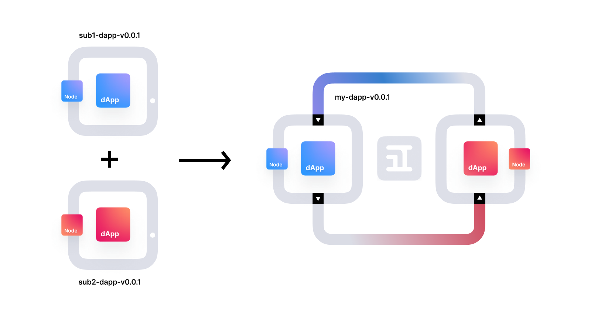

<br>
<br>
<div align="center">
    </img>
</div>

<h2 align="center">A Cloud Native Application Mesh.</h2>
<p align="center">Describe, connect, secure, test and deploy distributed applications with less effort.</p>

<p align="center">
    <a href="https://godoc.org/github.com/inspr/inspr">
        
    </a>
    <a href="https://goreportcard.com/badge/github.com/inspr/inspr">
        
    </a>
    <a href="https://pkg.go.dev/github.com/inspr/inspr">
        
    </a>
    <a href="https://codecov.io/gh/inspr/inspr">
        
    </a>
    <a href="https://github.com/inspr/inspr/blob/develop/LICENSE.md">
        
    </a>
    <a href="http://makeapullrequest.com">
        
    </a>
    <a href="https://discord.gg/RZmZG4auJy">
        
    </a>
</p>

<!-- <p align="center">
    <a href="https://stars.medv.io/inspr/inspr">
        
    </a>
</p> -->


---

<br>
Inspr is an agnostic application mesh for simpler, faster, and securer development of distributed applications (dApps). With it you can coordinate the application lifecycle and how the subparts of a dApp interconnect themselves.

For Inspr’s point of view, a dApp is defined as an abstraction on top of the concept of a microservice. We extend the model by adding patterns of composition, communication, security, and adaptability to the application during runtime.

## 🎛 Compose
<div align="center">

</div>

With Inspr one dApp can be connected to another and those two will become a new application. Consider as an example where we’re creating a online shop called “Sammyfy”. To build this product we’ll need a few services such as payment, catalog, and delivery.

Of course, we could create those three services and interconnect them by using Rest API or even something more robust like brokers. But it would still be hard and painful to manage all the dApps together. That’s why Inspr exists, so you can manage all three applications as one. 

## 📡 Comunicate

<div align="center">

</div>

## 🔐 Secure

## 🎮 Adapt


---
## Table of Contents

- [Getting Started](#getting-started)
- [Documentation](#documentation)
- [Architecture](#architecture)
- [Contributing](#-contributing)
- [License](#-license)
- [Contact](#-contact)

## 🎉 Getting Started

### Cluster
First of all, it's important to have access to a Kubernetes cluster that is up and running. The cluster can be hosted on a local machine, or via a cloud service like GCloud or AWS (more info about cluster creation [here](https://kubernetes.io/docs/tutorials/kubernetes-basics/create-cluster/)).

The recommended way to install Inspr in a Kubernetes cluster is by using Helm.  
Helm is a package manager for Kubernetes, and by using it the installation process is much simpler. Read more about Helm and how to install it [here](https://helm.sh/).

After downloading Helm, the first step is to add the Helm chart repository to the cluster:

```bash
# add the helm chart repository to the cluster:
helm repo add inspr https://inspr-charts.storage.googleapis.com

# replace inspr_name by the cluster's desired name and install insprd
helm install inspr_name inspr/insprd
```

Additionally you can check the default values file for the Helm chart. 
They are included in the `build/helm` folder and can be edited for further refinement and customization of it's properties.

### CLI
After installing Insprd in the cluster, the Inspr CLI must be installed so that it is possible to create and manage Inspr structures in the cluster. 

To install the CLI get the latest release for your architecture from the [`releases`](https://github.com/inspr/inspr/releases) page and add it to your PATH.  
For **Linux / Mac** you can install the latest version by running the following command on the terminal:
```bash
curl -s https://storage.googleapis.com/inspr-cli/install_cli.sh | bash
```  

You can check if the installation was successful by typing `inspr -h` on your terminal.  
Before starting to use the CLI, be sure to check that it is referencing your cluster. First check the current config using: 
```bash
inspr config list
```
And if the `serverip` is not the hostname currently being used to access the cluster IP, it must be modified:
```bash
inspr config serverip http://<your_domain>.com
```

And now you're good to go!  
To follow a step-by-step tutorial on how to implement your first Inspr application, [click here!](https://github.com/inspr/inspr/blob/develop/docs/workspace_init.md)

## Documentation

The full documentation for Inspr can be found on our [website](https://inspr.com/docs).
The source for the Inspr documentation and website is hosted on a separate repo, @inspr/docs.

## Architecture
- TBD

## 👏 Contributing

The main purpose of this repository is to continue evolving Inspr core. We want to make contributing to this project as easy and transparent as possible, and we are grateful to the community for contributing bug fixes and improvements.
To contribute, please check out our [guide](CONTRIBUTING.md).

## 📄 License

- Inspr is licenced under MIT [license](LICENSE.md).
- Inspr documentation is Creative Commons licensed, as found in the [license-docs](LICENSE-docs) file.

## 📣 Contact

To contact us, please join our [Discord community](https://discord.gg/tmp2564a54).
Aditionally we are at [Reddit](https://reddit.com/r/inspr)

