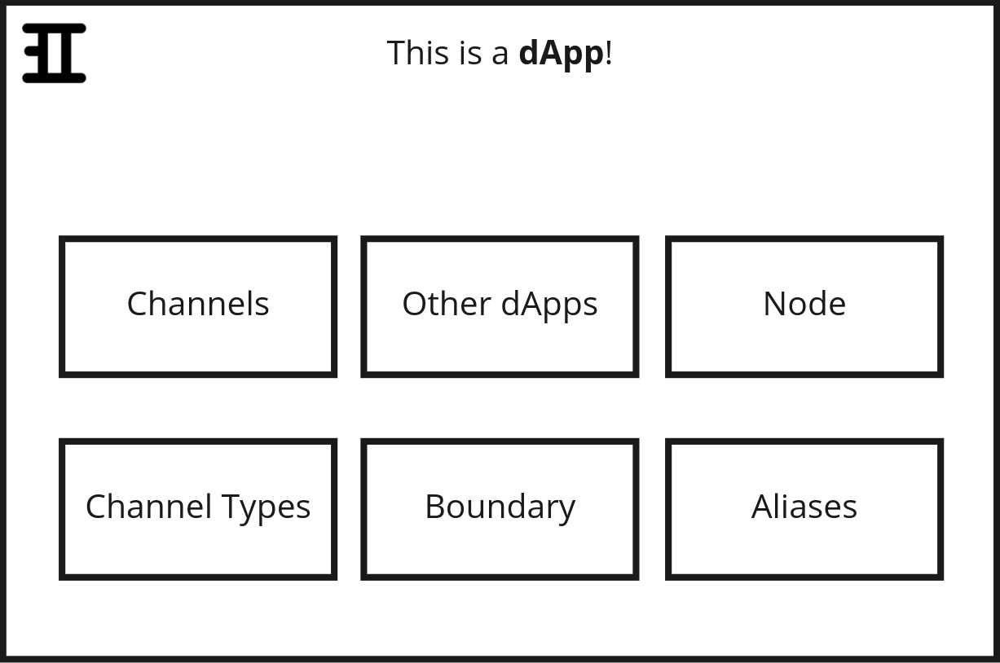
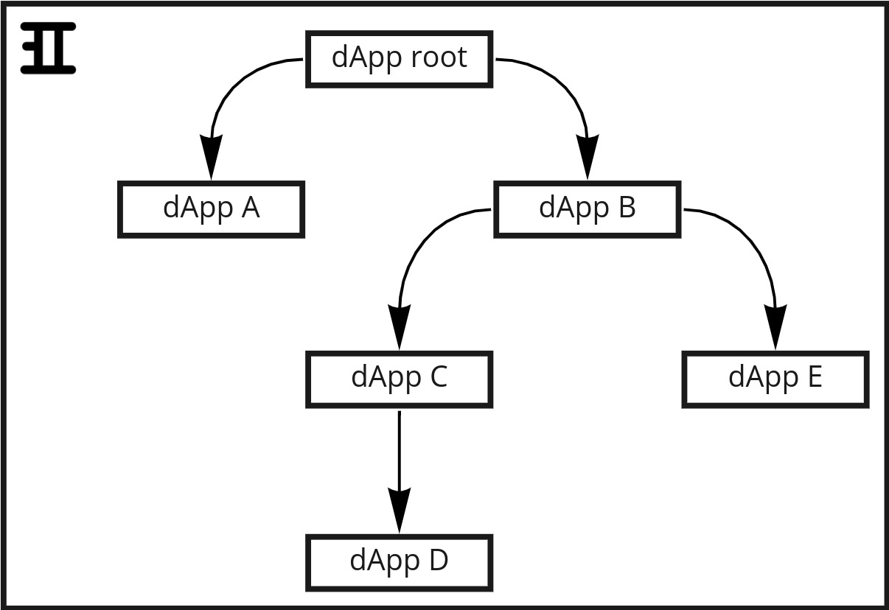

# dApp Architecture Overview
This document gives a brief introduction to Inspr's main structures, on how they are arranged and how they interect with eachother. Through the use of images and clear descriptions, this introduction will help you understand how and why your applications can be much more scalable and composable.

## What are dApps?  
A good analogy to make understanding Inspr structures easier is to think of it like a human-body cell. In a cell, amongst other various components, you have the cytoplasm, which is a solution that fills each cell and includes all of the material inside the cell and outside of the nucleus.  
A dApp can be seen like the cytoplasm of a cell: it's the base without which none of the other structures would exist, and it contains all the other structures inside of it. That is to say, a dApp is the base structure of Inspr, and inside of it there can be created Nodes, Channels, Channel Types and even other dApps!  

  

### It is relevant to point out that:
- All structures created by the user are (directly or not) inside of a **root dApp**;  
- A dApp **can't** contain other dApps if it contains a Node, and vice versa;
- Boundary defines by which Channels a dApp exchanges information with it's parent dApp;
- The global dApps organization is a tree-like structure:  

  

## What are Nodes?
If dApps are like the cell cytoplasm, Nodes can be considered mitochondrias - the power houses of the cell.  
Like mitochondrias have their own DNA and processes nutrients to generate energy for the cell, Nodes also define their own unique characteristics and generatesprocess the information that is used throughout the Inspr environment.  
A Node unique characteristics are defined by three structures set by the user when creating or updating a Node:
- **Image**: references the **Docker Image** of the application that will be run in the Node;
- **Replicas**: number of Node's replicas that will be created in the **k8s cluster**;
- **Environment**: user-defined environment variables that can be accessed from within the Node;  

**Nodes are created insite a Kubernetes cluster as Deployments.**  
As described previously in "What are dApps?", a dApp that contains a Node can't have child dApps. This means two things:
1) A Node is a dApp that has a Node structure defined in it.
    - This implies that Nodes make use of all the structures defined within it's dApp (Channels, Channel Types, Boundaries and Aliases)
2) In the tree-like organization, Nodes are always leaves.

## What are Channels?  
Channels, like cell membranes, are the structures that allow dApps and Nodes to exchange informations between eachother.  
A dApp/Node inputs and outputs are defined by it's Boundary. The Boundary, on the other hand, references a parent dApp's Channel.

  

Channels are created to receive and send a specific kind of information or data. This specification is defined by a **Channel's Type**, which is a reference to a Channel Type structure defined in the same context (in the same dApp) as the Channel. In other words:
- A Channel only carries a specific kind of data (such as *int*, *string*, or an object defined by the user);
- A Channel can't exist without a Channel Type;

## What are Channel Types?
If Channels can be compared to a cell membrane, Channel Types would be the membrane's proteins. That is, a Channel is the way in or out of a dApp, but the **type of information that can go through it is defined by the Channel Type.**  
Each Channel Type has it's own list of Channels that are connected to it, so that while there are connections, the Channel Type can't be deleted.  
Also, the kind of information that can go through a Channel is specified in it's Channel Type's Schema. **A Channel Type Schema is an Avro schema, in string format.**  
Generate Avro schema from a JSON [here](https://toolslick.com/generation/metadata/avro-schema-from-json).

## How is information passed between Nodes?

## What are Aliases?