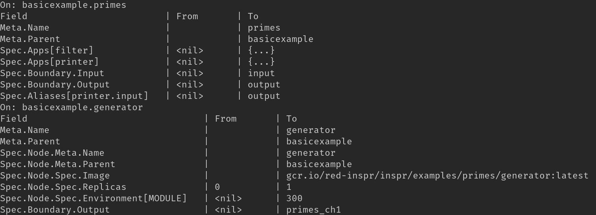

# Inpsr CLI Difference Output

This document is to futher describe how the difference generated by the `inspr apply` operation works and what it described to the user.

## What is it?

The difference is the reply given to the user when he decides to make a change in the current state of his cluster.

Look at this output example

The example shows only a section of the output given when we apply the general.yaml of the primes example, it informs the user that previously there was nothing in these dApps, meaning that they didn't exist, and that now all the fields given have changed values.

This feature is particulary useful when using the flag 'dryRun', which means that your changes aren't directly affecting your cluster. This way the user has more control over what he is changing and can see the possible side affects of his intended changes.

## How is it formed

## Types of differences

List of types:
- from nothing/<nil> to a defined type (string,int,float)
- from nothing/<nil> to a struct, represented as {...}

## some other topic?
