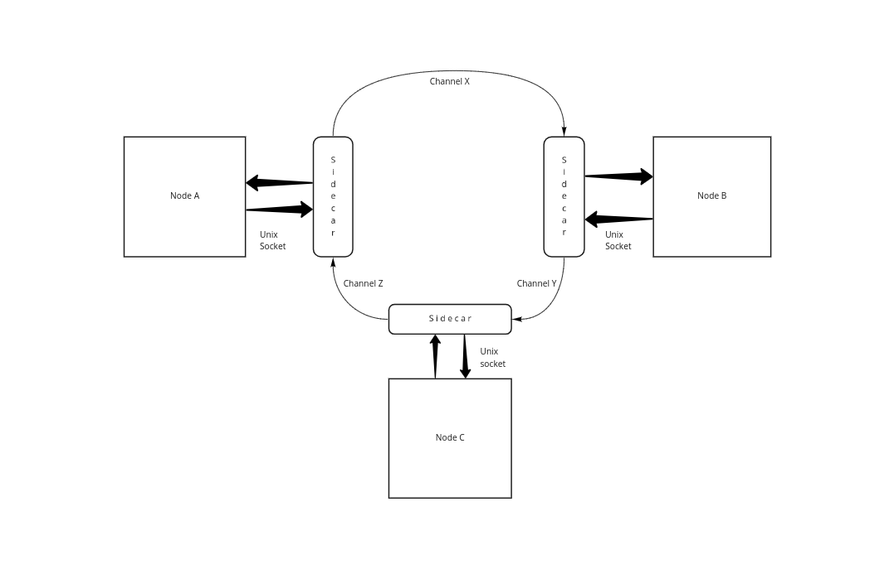

# Sidecar API

## Sidecar Architecture

### Overview

When creating a inspr's dApp in your cluster is possible to define the Input and Output of your application, that means that in the eyes of the the `dApp` there is a way in which he can easily communicate between other dApps, this is the so called `Channel`. This component is somewhat intuitive but he alone is not responsible for the exchange of data between dApps, the one that allows for a easy commmunication is the so called `sidecar`.

But what is exactly a `sidecar` and how can it be utilized? Firstly is important to remember that what inspr actually uses for communication is a message broker, this means that there are topics that our application can write to and read from. This is nice to know about but here is where the `sidecar` acts, being a layer of abstration that simplifies the whole process by a substantial margin.

This component is already implemented and resolves most of the procedings that one must do to send data to a topic in the message broker, or to read from it. This means that using the sidecar API the developer can focus on its application, when trying to communicate with another dApp of his cluster there is only the need to do a http request with the content of the message.



### Unix Socket

In the image shown above it's easy to see how in general way the sidecar maintains the communication between the dApps, but there is one element of the image that is somewhat new, that would be the word `Unix Socket` in the lines between the Sidecar and the dApp.

In actuality the inspr deamon created a Sidecar together with every dApp, these share the same disk space in which the exchange of data occurs. It is extremely reliable and fast method that allows for a quicker exchange of information.


### The client side

On the client side there are three main methods that are used to process information:

 - ReadMessage
 - WriteMessage
 - CommitMessage

All of these three methods are responsible to establish a solid communication between the dApp and the Sidecar, all of this are done through the Unix socket.


##### ReadMessage
> Responsible for reading a message from a Channel
> 
> This method receives as parameters
>- Context: [golang's context](https://golang.org/pkg/context/), a way to carried deadlines and cancel signals.
>- Channel: Name of the Channel in which the message will be read from.
>- Message: A user defined struct that allows him to establish his own format to the message going to the Channel:
>    - ```Message{ defined struct inside of here } `json:"message"` ```

##### Snippet example:
```
type Message struct {
    Message struct {
        Data int `json:"data"`
    } `json:"message"`    
}

var msg Message

err := client.ReadMessage(
    context.Background(),
    inputChannel,
    &msg,
)
```

##### CommitMessage

> Responsible for confirming that it succesfully processed the message previously read.
> 
>This method receives as parameters
>- Context: [golang's context](https://golang.org/pkg/context/), a way to carried deadlines and cancel signals.
>- Channel: Name of the Channel in which the message will be read from.

##### Snippet example:
```
...
err := client.ReadMessage(
    context.Background(),
    inputChannel,
    &msg,
)
...
# do stuff with the data
...
err = client.CommitMessage(
    context.Background(),
    inputChannel,
)
```


##### WriteMessage
> Responsible for writing the message into the Channel
>
>This method receives as parameters
>- Context: [golang's context](https://golang.org/pkg/context/), a way to carried deadlines and cancel signals.
>- Channel: Name of the Channel in which the message will be read from.
>- Message: A struct that containg only one field
>    - Data: An interface{} type that allows the user to send anything to the channel.

##### Snippet example
```
client.WriteMessage(
    context.Background(),
    outputChannel,
    models.Message{
        Data: 123,
    },
)
```

### The server side

The server side is the section of the sidecar that is responsible to communicate with external elements of the cluster, in the image previously shown is perceivable that what we call an exchange of information between two dApps is nothing more than

<center> dApp_1 -> sidecar_1 -> sidecar_2 -> dApp_2 </center>

Some small observations is that when trying to send a message if a unknown Channel is specified in the Client, the server will identify that such Channel doesn't exist an return an error to the Client request.


### How scalable is it?

The extra layer of abstraction around the message broker allow for the intense usage of the broker's capability in a easy to use fashion, this simple choice allows to send and receive a 


### What are it's benefits


