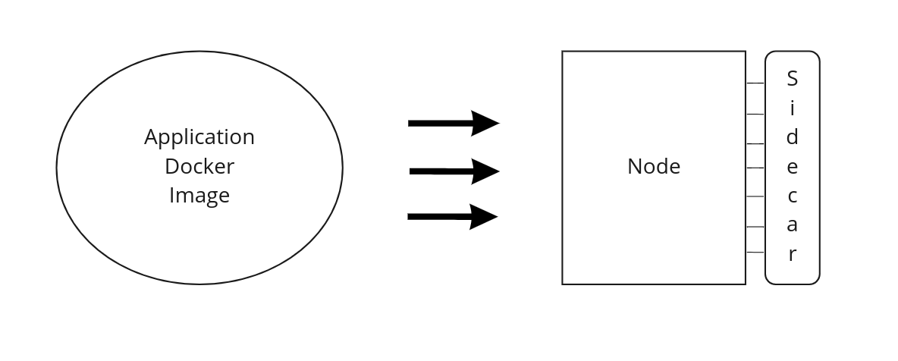

# Sidecar API

## Sidecar Architecture

### Overview

When creating a inspr's dApp in your cluster is possible to define the Input and Output of your application, that means that in the perspective of the the `dApp` there is a way in which he can easily communicate between other dApps, this is the Inspr's `Channel`. This component is somewhat intuitive but he alone is not responsible for the exchange of data between dApps, the one that allows for easy communication is the so-called `sidecar`.

But what is exactly a `sidecar` and how can it be utilized? Firstly is important to remember that what inspr actually uses for communication is a message broker, this means that there are topics that our application can write to and read from. This is nice to know about but here is where the `sidecar` acts, being a layer of abstraction that simplifies the whole process by a substantial margin.

This component is already implemented and resolves most of the proceedings that one must do to send data to a topic in the message broker, or to read from it. This means that using the sidecar API the developer can focus on his application, and when trying to communicate with another dApp of his cluster there is only the need to do a http request with the content of the message.


### How is the Sidecar created?

When creating a dApp the user must specify the content of it's node, that means creating the docker image of his application and referencing it to the dApp. Another important topic treated in the creation is the Channels which he communicates with.

When the inspr daemon receives both of these informations it creates the Node according to the docker image given and then creates a Sidecar attached to it like the example below:




### Unix Socket

The sidecar maintains the communication between its Node and other Nodes in the cluster, but what is represented in the image above as lines connecting the Sidecar and Node is in actuality a unix socket.

A unix socket is a shared partition between the Node and the Sidecar's Server, it is an extremely reliable and fast method that allows for a quicker exchange of information.

### The client side

On the client side there are three main methods that are used to process information:

 - ReadMessage
 - WriteMessage
 - CommitMessage

All of these three methods are responsible to establish a solid communication between the dApp and the Sidecar, all of this are done through the Unix socket.


#### ReadMessage
```go
// ReadMessage receives a channel and sends it in a request to the sidecar server
func (c *Client) ReadMessage( ctx context.Context, channel string, message interface{} ) error
```

> Description of parameters
>- Context: [golang's context](https://golang.org/pkg/context/), a way to carry deadlines and cancel signals.
>- Channel: Name of the Channel in which the message will be read from.
>- Message: A user defined struct that allows him to establish his own format to the message going to the Channel:
>    - Message{ defined struct inside of here } 'json:"message"'

##### Snippet example:
```go
type Message struct {
    Message struct {
        Data int `json:"data"`
    } `json:"message"`    
}

var msg Message

err := client.ReadMessage(
    context.Background(),
    inputChannel,
    &msg,
)
```

#### CommitMessage

```go
// CommitMessage receives a channel and sends it in a request to the sidecar server
func (c *Client) CommitMessage(ctx context.Context, channel string) error 
```

> Description of parameters
>- Context: [golang's context](https://golang.org/pkg/context/), a way to carry deadlines and cancel signals.
>- Channel: Name of the Channel in which the message will be read from.

##### Snippet example:
```go
...
err := client.ReadMessage(
    context.Background(),
    inputChannel,
    &msg,
)
...
// do stuff with the data
...
err = client.CommitMessage(
    context.Background(),
    inputChannel,
)
```


#### WriteMessage

```go
// WriteMessage receives a channel and a message and sends it in a request to the sidecar server
func (c *Client) WriteMessage(ctx context.Context, channel string, msg models.Message) error
```

> Description of parameters
>- Context: [golang's context](https://golang.org/pkg/context/), a way to carry deadlines and cancel signals.
>- Channel: Name of the Channel in which the message will be read from.
>- Message: A struct that contains only one field
>    - Data: An interface{} type that allows the user to send anything to the channel.

##### Snippet example
```go
client.WriteMessage(
    context.Background(),
    outputChannel,
    models.Message{
        Data: 123,
    },
)
```

### The server side

The sidecar server is responsible for reading from and writing to the message broker. It implements a simple rest API, to interact with the client, counting with only 3 endpoints. 

These endpoints are: 
- "/readMessage"
- "/writeMessage"
- "/commit".
 
Respectively these implement the server-side functionalities to: 
- ReadMessage: reads a message from a specific channel
- WriteMessage: writes a message to a specific channel
- Commit: confirms that a message has been read

Each server has two environment variables that determine which channels it can use for input and output. When it receives a request it first checks whether or not the channel specified on the request is valid for the requested operation. Following that it simply completes the operation.

One small observation is that when trying to send a message, if an unknown Channel is specified in the Client, the server will identify that such Channel doesn't exist and return an error to the Client request.
