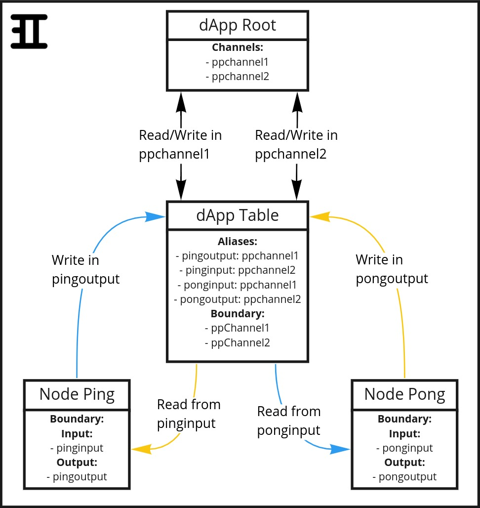

TODO:
2) Run pingpong demo and print the results (apply results and it working in the cluster)
3) Record a video of everything

# Workspace Initialization
This document is a detailed guide on how to create an application and deploy an Inspr workspace that cointains it into a Kubernetes cluster.  

**It is mandatory to have [Docker](https://docs.docker.com/get-docker/), [Kubernetes](https://kubernetes.io/docs/tasks/tools/), [Insprd](helm_installation.md) and [Inspr CLI](cli-install.md) installed.**  
Also, this tutorial will be using the Message Broker [Apache Kafka](https://kafka.apache.org/). You can see how to install it in your cluster [here](https://bitnami.com/stack/kafka/helm). 

The Inspr workspace that will be created through this guide contains two applications that communicate with each other:
- **Ping**, that writes the string "Ping!" into a Channel, and reads what's written by the other application in another Channel.
- **Pong**, that writes the string "Pong!" into a Channel, and reads what's written by the other application in another Channel.    

The tree-like structure of this Inspr workspace will be similar to this:  



## Creating the folder structure

First of all, let's create the folders in which we will store all of our files (application codes, Dockerfiles, YAMLs, etc.).

Create a folder called "pingpong_demo", and inside of it create other three folders: "ping", "pong" and "yamls".  

The first two, "ping" and "pong", will store the applications code and their respective Dockerfiles. The last one, "yamls", will store all the *.yaml* files that define the structures which will be used to create the Inspr workspace in the cluster.  

The following command creates the wanted folder structure:
```
mkdir -p pingpong_demo/ping pingpong_demo/pong pingpong_demo/yamls
```

It should be organized like this:
```
pingpong_demo
├── ping
├── pong
└── yamls
```

## Creating the applications

In this part, we will implement Ping and Pong using Golang. Also, we will create their respective Dockerfiles, build the Docker Images and push them into the cluster.  

### Ping and Pong implementation  

From within "pingpong_demo", create a file called *ping.go* inside folder "ping":  
```
touch ping/ping.go
```  

In *ping.go*, we will define a `main` function that does the following:

1) Creates a new dApp Client, which is used to write and read messages in Channels through the Sidecar (check [dApp Architecture Overview](dapp-overview.md) for more details).
2) Initiates an endless `for loop` in which the message "Ping!" is written in the Channel *ppChannel1*, then the application proceeds to read a message from Channel *ppChannel2*. If there is a message, it's read and displayed in the terminal.

*ping.go* should look like this:
```Go
package main

import (
	"fmt"

	dappclient "gitlab.inspr.dev/inspr/core/pkg/client"
	"gitlab.inspr.dev/inspr/core/pkg/sidecar/models"
	"golang.org/x/net/context"
)

type expectedDataType struct {
	Message struct {
		Data int `json:"data"`
	} `json:"message"`
	Channel string `json:"channel"`
}

func main() {

	client := dappclient.NewAppClient()
	ctx, cancel := context.WithCancel(context.Background())
	defer cancel()

	for {
		sentMsg := models.Message{
			Data: "Ping!",
		}

		if err := client.WriteMessage(ctx, "ppChannel1", sentMsg); err != nil {
			fmt.Println(err)
			continue
		}

		var recMsg expectedDataType
		err := client.ReadMessage(ctx, "ppChannel2", &recMsg)
		if err != nil {
			fmt.Println(err)
			continue
		}
		fmt.Println("Read message: ")
		fmt.Println(recMsg.Message.Data)

		if err := client.CommitMessage(ctx, "ppChannel2"); err != nil {
			fmt.Println(err.Error())
		}
	}
}
```

Notice that before the `main` function a new structure called `Message` is declared, which contains a field called "Channel" that is a string, and another field called "Message" aswell.  
**In Inspr, the user is encouraged to define which type of message he expects to read from a Channel, so that unexpected messages of different types don't cause unexpected errors.**  
So everytime one implements an application that reads messages, a structure such as the following should be created and passed as an argument for `ReadMessage` method:
```Go
type YOUR_STRUCTURE_NAME struct {
	Message struct {
		Data DESIRED_DATA_TYPE `json:"data"`
	} `json:"message"`
	OPTIONAL_FIELD_1 string `json:"OPTIONAL_FIELD_1_TAG"`
	OPTIONAL_FIELD_2 int `json:"OPTIONAL_FIELD_2_TAG"`
	OPTIONAL_FIELD_3 struct `json:"OPTIONAL_FIELD_3_TAG"`
	...
}
```
As seen above, the only mandatory fields inside of your custom structure are `Message` and `Data`, and their respective [JSON tags](https://medium.com/golangspec/tags-in-golang-3e5db0b8ef3e). `Data`'s field type is chosen by you, and can even be a new structure!  


Proceeding the tutorial, a similar folder/file structure and code must be done to implement Pong. So, from within "pingpong_demo", create *pong.go* in /pong folder:  
```
touch pong/pong.go
```  

And then write a code similar to *ping.go*'s, just remember to swich the Channels and the message that is written. It should look like this:
```Go
package main

import (
	"fmt"

	dappclient "gitlab.inspr.dev/inspr/core/pkg/client"
	"gitlab.inspr.dev/inspr/core/pkg/sidecar/models"
	"golang.org/x/net/context"
)

type expectedDataType struct {
	Message struct {
		Data int `json:"data"`
	} `json:"message"`
	Channel string `json:"channel"`
}

func main() {

	client := dappclient.NewAppClient()
	ctx, cancel := context.WithCancel(context.Background())
	defer cancel()

	for {
		sentMsg := models.Message{
			Data: "Pong!",
		}

		if err := client.WriteMessage(ctx, "ppChannel2", sentMsg); err != nil {
			fmt.Println(err)
			continue
		}

		var recMsg expectedDataType
		err := client.ReadMessage(ctx, "ppChannel1", &recMsg)
		if err != nil {
			fmt.Println(err)
			continue
		}
		fmt.Println("Read message: ")
		fmt.Println(recMsg.Message.Data)

		if err := client.CommitMessage(ctx, "ppChannel1"); err != nil {
			fmt.Println(err.Error())
		}
	}
}
```

### Dockerfiles
Now that we have Ping and Pong implemented and doing what they are supossed to do, we must create their Dockerfiles, so we can generate a Docker Image for each of them, and make these images available in our cluster.  
If you are not familiar with Docker, click on the following for more information:
- [Docker overview](https://docs.docker.com/get-started/overview/)
- [Docker Images](https://jfrog.com/knowledge-base/a-beginners-guide-to-understanding-and-building-docker-images/#:~:text=A%20Docker%20image%20is%20a,publicly%20with%20other%20Docker%20users.)
- [Dockerfiles](https://docs.docker.com/engine/reference/builder/)  

From within "pingpong_demo", create a file called *Dockerfile* inside folder "ping":  
```
touch ping/Dockerfile
```  
The Dockerfile structure will be created to do the following:
1) Use Golang alpine version as base to run the commands.
2) Define "/app" as the working directory where Ping will be build.
3) Copy the *ping.go* file into "/app".
4) Compile and build the *ping.go* file.

Ping's Dockerfile should look like this:
```Docker
FROM golang:alpine
WORKDIR /app
COPY . .
CMD go run pingpong_demo/ping/ping.go
```

Then, do the same steps for Pong:
```
touch pong/Dockerfile
```  

And Pong's Dockerfile content:
```Docker
FROM golang:alpine
WORKDIR /app
COPY . .
CMD go run pingpong_demo/pong/pong.go
```

### Docker Image deployment
After creating the Dockerfiles, we must build the Docker Images and push each of them into the cluster, so they are available to be used in the Inspr workspace.  

First, from "/pingpong_demo", go into "/ping" folder:
```
cd ping
```

In the next steps, it's important to have a live [container registry](https://cloud.google.com/container-registry) up and running, so it's possible to store and use the images that will be built.

Then we must build the Docker Image by using the Dockerfile previously created. You can apply a tag to it by adding `:TAG_NAME`, if desired:
```
docker build -f Dockerfile -t PING_IMAGE_TAG/app/ping:TAG_NAME
```

Finally, we push the builded image into the cluster, where **PING_IMAGE_TAG is a reference to the container registry**:
```
docker push PING_IMAGE_TAG/app/ping:latest
```

Now the same must be done to Pong. Go back to "/pingpong_demo" folder, and access "/pong" folder:
```
cd ..
cd pong
```

Build the Docker Image by using the Dockerfile previously created (and applying a tag to it, if desired). Similarly, **PONG_IMAGE_TAG is a reference to the container registry**:
```
docker build -f Dockerfile -t PONG_IMAGE_TAG/app/pong:TAG_NAME
```

Push the builded image into the cluster:
```
docker push PONG_IMAGE_TAG/app/pong:TAG_NAME
```  

**Alternatively, you can create a [Makefile](https://opensource.com/article/18/8/what-how-makefile) that will do the previous steps for you.**  
Inside "/pingpong_demo" folder, create a new file called "Makefile:
```
touch Makefile
```
The Makefile should contain the same Docker commands that you'd use to build and push Ping and Pong Docker images. The gain here is that instead of writing and executing four different commands, you just execute the Makefile. It should look like this:
```Makefile
build:
	docker build -t PING_IMAGE_TAG/app/pong:TAG_NAME -f ping/Dockerfile
	docker push PING_IMAGE_TAG/app/pong:TAG_NAME
	docker build -t PONG_IMAGE_TAG/app/pong:TAG_NAME -f pong/Dockerfile
	docker push PONG_IMAGE_TAG/app/pong:TAG_NAME
```

And then execute the Makefile through the terminal:
```
make
```

## Creating Inspr Workspace

Now that we have our applications implemented and their Docker images available in the cluster, we're good to go and build Inspr structures to use what we created.

### YAML Files
First of all, from "/pingpong_demo" we access the folder "/yamls" created previously.
```
cd yamls
```
And within this folder we will create the *.yaml* files which describe each of the Inspr structures that will be built inside the cluster. This part of the tutorial wont take a closer look at every minimum detail on writing the YAML files, but you can find more information about it [here](yamls.md).

**1) dApp YAMLs**  
The first file to be created is *table.yaml*, which is the dApp that will contain all the other structures (Ping and Pong Nodes, Channels and Channel Type):
```
touch table.yaml
```

As it's described in Inspr YAMLs documentation, we must specify the kind, apiVersion and then the dApp information. This file have a really simple dApp definition, for its the base on which everything else will be created on. It should be like this:  
```YAML
kind: dapp
apiVersion: v1

meta:
  name: ppTable
```

The next file to be created is *ping.app.yaml*, in which we describe the Node that contains Ping. For better organization, let's create a new folder inside of "/yamls" called "nodes", inside of which we will store the Nodes YAMLs:
```
mkdir nodes
touch nodes/ping.app.yaml
```

Then, insite of *ping.app.yaml* we must specify the kind, apiVersion and then the Node information (such as name, boundaries, image, etc.).  
It should look like this:
```YAML
kind: dapp
apiVersion: v1

meta:
  name: ping
  parent: ppTable
spec:
  node:
    spec:
      replicas: 1
      environment:
        SUPER_SECRET_0001: "false"
      image: PING_IMAGE_TAG/app/ping:TAG_NAME
  boundary:
    input:
      - ppChannel2
    output:
      - ppChannel1
```
The `image` field must be a reference to the same image built in the step "Docker Image deployment". Also, the `environment` field is defined just so we can see that the environment variable "SUPER_SECRET_0001" will be created in the cluster, inside Ping's deployment.  

Now, we do the same for Pong:
```
touch nodes/pong.app.yaml
```
And *pong.app.yaml* should look like this:
```YAML
kind: dapp
apiVersion: v1

meta:
  name: pong
  parent: ppTable
spec:
  node:
    spec:
      image: PONG_IMAGE_TAG/app/pong:TAG_NAME
  boundary:
    input:
      - ppChannel1
    output:
      - ppChannel2
```
Notice that we didn't specify the number of replicas for Pong. This is to show that, **if not specified, the default number of replicas is created, which is one.**  

**2) Channel YAMLs**  
As it can be seen in Ping and Pong YAMLs, there are two Channels that need to be created. Similar to dApp, we must specify the kind, apiVersion and then the Channel information. Notice that the Channels annotations refer to Kafka attributes.  

Let's proceed to create "/channels" folder inside of "/yamls", and then create *ch1.yaml*:
```
mkdir channels
touch channels/ch1.yaml
```

It's content should be:
```YAML
kind: channel
apiVersion: v1

meta:
  name: ppChannel1
  parent: ppTable
  annotations:
    kafka.replication.factor: 1
    kafka.partition.number: 2
spec:
  type: ppCType1
```

Now we do the same for *ch2.yaml*:
```
touch channels/ch2.yaml
```

And it's content should be:
```YAML
kind: channel
apiVersion: v1

meta:
  name: ppChannel2
  parent: ppTable
  annotations:
    kafka.replication.factor: 1
    kafka.partition.number: 2
spec:
  type: ppCType1
```  

**3) Channel Type YAML**
Both Channels use the same Channel Type to define the kind of message that goes through them. So, again, we must specify the kind, apiVersion and then the Channel Type information.  
First we create "/ctypes" folder and *ct1.yaml*:
```
mkdir ctypes
touch ctypes/ct1.yaml
```

And it's content should be:
```YAML
kind: channeltype
apiVersion: v1

meta:
  name: ppCType1
  parent: ppTable
schema: yamls/ctypes/schema.avsc
```

Notice that the `schema` field is actually a reference to an **Avro Schema** file. By defining it like this, when a Channel Type is created Inspr searches for the file and injects its value into the `schema`. You can find more information on how schemas should be created to be used in Inspr [here](schemas_and_types.md).  
To make everythink work properly, let's create *schema.avsc*:  
```
touch ctypes/schema.avsc
```

As we defined in our Ping and Pong applications, the type of information that they will send and receive is just a simple string. To do so, *schema.avsc* content should be:
```
{"type":"string"}
```

After creating all of these folders and files, you should have this:
```
pingpong_demo
├── Makefile
├── ping
│   ├── Dockerfile
│   └── ping.go
├── pong
│   ├── Dockerfile
│   └── pong.go
└── yamls
    ├── channels
    │   ├── ch1.yaml
    │   └── ch2.yaml
    ├── ctypes
    │   ├── ct1.yaml
    │   └── schema.avsc
    ├── nodes
    │   ├── ping.app.yaml
    │   └── pong.app.yaml
    └── table.yaml
```

### Deploying dApps, Channels and Channel Type
Finally, now that we have Ping and Pong images in the cluster and all Inspr workspace structures well-defined in YAML files, we can deploy everything that we created and see it working in our cluster.  

First of all, we need to check if **Inspr CLI** is referring to the [cluster ingress](https://kubernetes.io/docs/concepts/services-networking/ingress/) address, so we're able to send requests to it. To do so, run the command:
```
inspr config list
```
And something similar to the following should be shown:
```
Available configurations: 
- scope: ""
- serverip: "http://localhost:8080"
```
If the `serverip` is not your cluster ingress host, as the example above, you must change it:
```
inspr config serverip "CLUSTER_INGRESS_HOST"
```
And this will be printed in the terminal:
```
Success: inspr config [serverip] changed to 'CLUSTER_INGRESS_HOST'
```


Now, from within "/pingpong_demo" folder, we apply the YAML files by using Inspr CLIs commands. The files should be applied in the following order:  
1) dApp `ppTable`
2) Channel Type `ppCType1`
3) Channels `ppChannel1` and `ppChannel2`
4) Nodes `ping` and `pong`  

You can do so by running the following commands from within "/pingpong_demo" folder:
```
inspr apply -f yamls/table.yaml
inspr apply -k yamls/ctypes
inspr apply -k yamls/channels
inspr apply -k yamls/nodes
```
To learn more about Inspr CLI, check [this](cli_commands.md) documentation.  

If everything worked fine, the Inspr Workspace changelog will have printed something similar to this in your terminal:  
