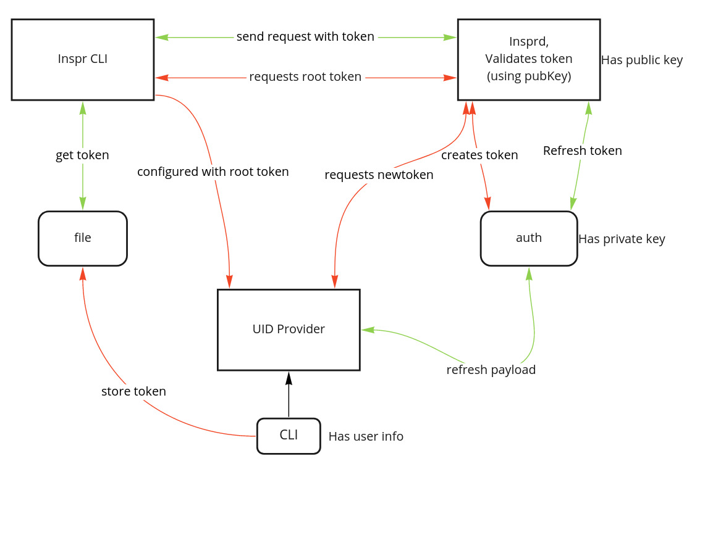

# Authentication
Inspr's CLI requires permission to access the cluster and perform commands. We can rely on the Kubernetes model where authentication is done through a context. You can run multiple Inspr instances from your local machine, all that is required is to be authenticated with each cluster.
 
Each cluster is responsible for managing the access to its resources based on these permissions, validating each request it receives with an access token. This is responsible for the access control on Inspr, however it does not provide user identity. Inspr's authentication was designed to work with third party identity providers, much like how Kubernetes does it.  
 
## Authentication Architecture
 
### Overview/Design
When performing any request to your Inspr deployment the `insprctl` CLI sends an authentication token to Insprd. This token is validated for expiration and for permission to perform the requested action on the specified scope. If the token is expired the Inspr system then sends a refreshing request to the identity provider that updates that user's permissions according to it's latest information.
 
The authentication on an Inspr cluster is handled by a service of its own, `auth-svc` which is deployed right before the Insprd deployment goes up.

 
### Init
When first deploying Inspr the user must define an initialization key for his Insprd, this can be done by overwriting Helm Chart's value "deployment.initKey". Once the Helm Chart has been installed it triggers a pre-installation hook that creates 512 bytes encryption and decryption keys on Kubernetes secrets, if these don't exist already. These secrets are protected by Kubernetes and made available only to `auth-service` and `insprd` respectively.
 
After the deployment is done the user must execute the cluster init command: `insprctl cluster init <initKey>`. This will return a token that can be used to configure the identity provider of choice to work with the newly installed Inspr instance.
 
 
### Validation
 
The validation process used on Inspr is aligned with most modern systems, the Json Web Token, which must be provided on the request's header using the "Authorization" key, carries a payload of informations including a set of scopes, each one associated with a list of permissions that define what actions the token's bearer can perform per scope. Every time the system receives a request the token's signature is validated using the public key to guarantee authenticity and integrity. Once validated, the token payload is verified to assure that the user can perform the request action on the target scope.
 
### Refresh
 
Like any implementation of authentication through JWT, Inspr's user token has a relatively small expiration time. This however doesn't mean the user must login on his identity provider constantly. The token carries within its payload all the information required to refresh itself without any action from the user, meaning that in most use cases a user may only ever need to login once.
 
The refreshening of the token happens on the identity provider, Inspr simply requests it. To do so the auth service uses, from the payload of token it receives, both the address for refreshing and the refresh token created by the identity provider, which stays embedded on the user's token. With this information a request is made and it's return will either confirm the claims of the original token, in which case the verification process continues, or fails. When the token is refreshed an important process takes place, the updating of the user's token. The newly renewed token is included in the header of the response generated for the CLI, that identifies the new token and updates the user's stored token.
