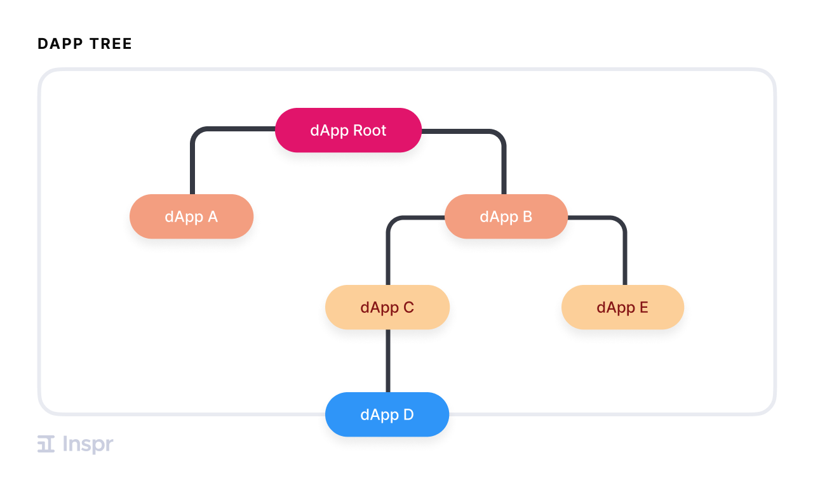
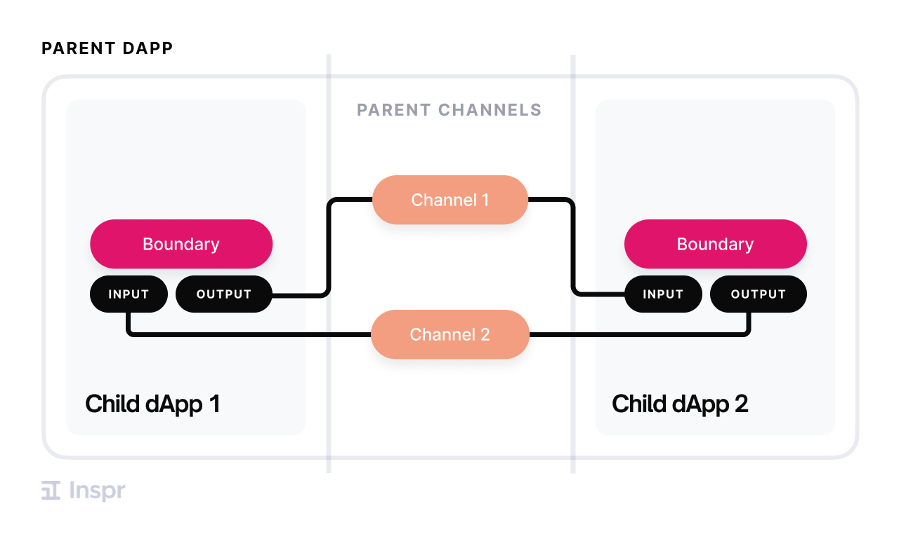
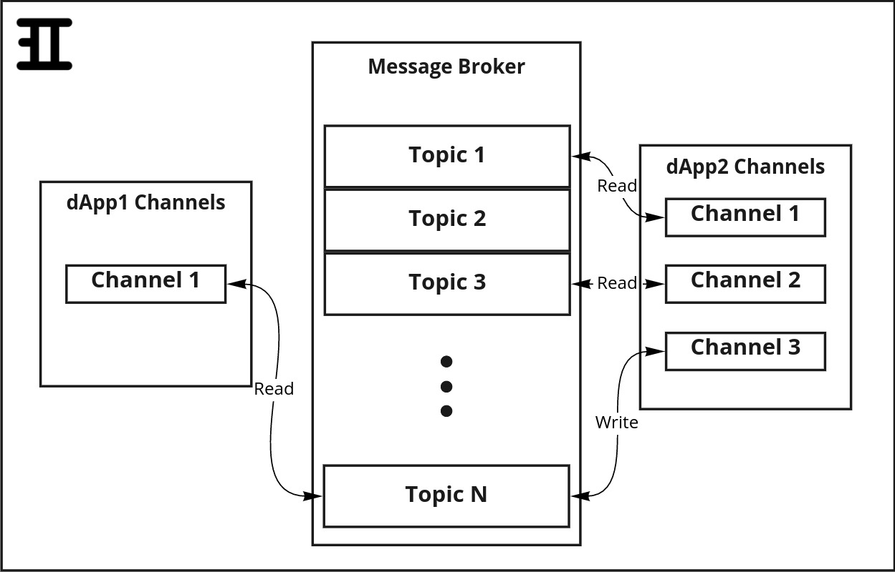
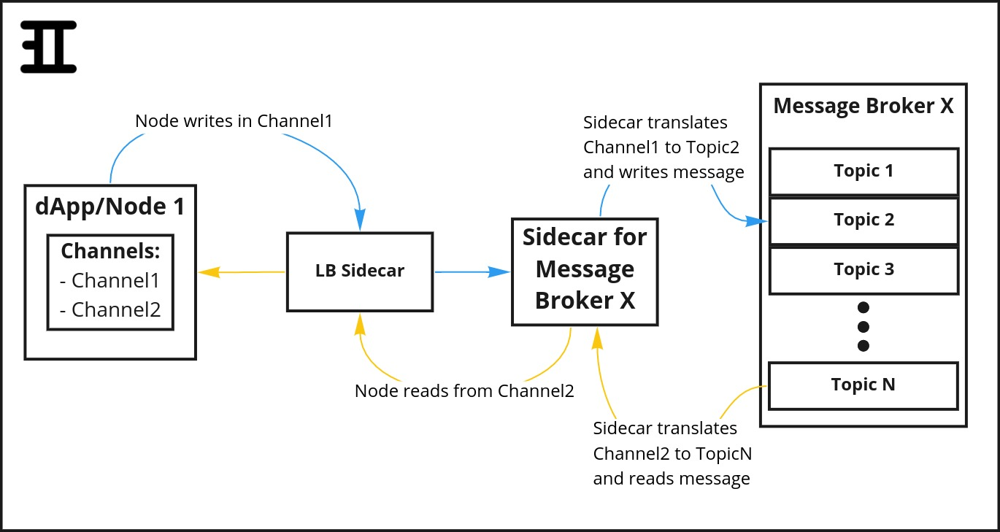
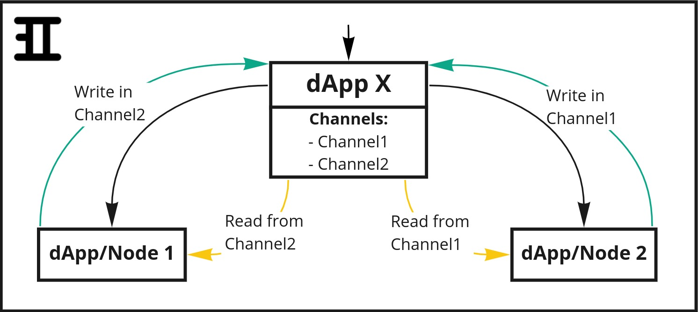
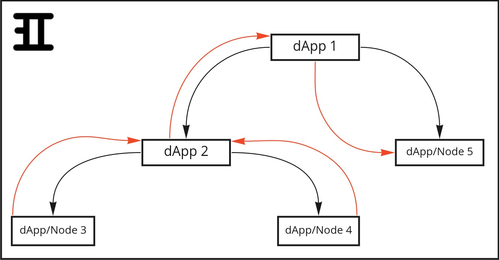
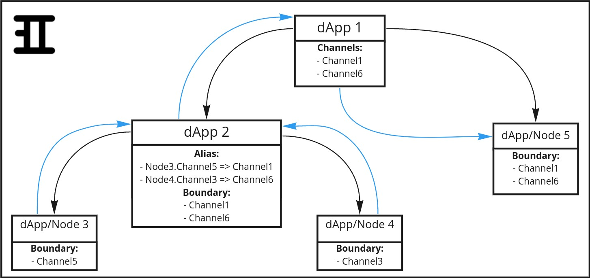

# dApp Architecture Overview
This document gives a brief introduction to Inspr's main structures, on how they are arranged and how they interact with each other. Through the use of images and clear descriptions, this introduction will help you understand how and why your applications can be much more scalable and composable.

## What are dApps?  
A dApp is the base without which none of the other structures would exist, it contains all other structures inside of it. That is to say, a dApp is the base structure of Inspr, and inside of it there can be created Channels, Types, Routes and even other dApps!  
A dApp can also be a Node, which is basically the same as a normal dApp but has slightly different functionalities, which will be discussed ahead.

### It is relevant to point out that:
- All structures created by the user are (directly or not) inside of a **root dApp**.  
- A dApp **can't** contain other dApps if it is a Node, and vice versa.
- Boundary defines by which Channels a dApp exchanges information with it's parent dApp.
    - Aliases can be used to implement a multi-layer communication.
- The global dApps organization is a tree-like structure:  

  

## What are Nodes?
Nodes are central control structures that have unique characteristics and generate/process the information that is used throughout the Inspr environment.  
The unique characteristics of a Node are defined by three structures set by the user when creating or updating a Node:
- **Image**: references the **Docker Image** of the application that will be run in the Node.
- **Replicas**: number of Node's replicas that will be created in the **k8s cluster**.
- **Environment**: user-defined environment variables that can be accessed from within the Node.  

**Nodes are created inside a Kubernetes cluster as Deployments.**  
As described previously in "What are dApps?", a dApp that is a Node can't have child dApps. This means that:
1) A Node is a dApp that has a Node structure defined in it.
    - This implies that Nodes make use of all the structures defined within it's parent (Channels, Types, Boundaries and Aliases)
2) In the tree-like organization, Nodes are always leaves.

## What are Channels?  
Channels are the structures that allow dApps and Nodes to exchange information between each other via message brokers.  
A dApp/Node inputs and outputs are defined by it's Boundary. The Boundary, on the other hand, references a parent dApp's Channel (or Alias, which will be described ahead).

  

Channels are created to receive and send a specific kind of information. This specification is defined by it's **Type**, which is a reference to a Type structure defined in the same context (in the same dApp) as the Channel. In other words:
- A Channel only carries a specific kind of data (such as *int*, *string*, or a structure defined by the user).
- A Channel can't exist without a Type associated to it.  

In a more detailed explanation, the cluster's structures communication can be done through a [Message Broker](https://en.wikipedia.org/wiki/Message_broker) (such as Apache Kafka, RabbitMQ, etc.). So what a Channel really does is to define from which part of the broker (which topic) a Node should read a message, or to which part it should write a message.  
It's relevant to point out that **a Channel can be associated with only one message broker**. That is, if the implementation of a Node that communicate with Kafka and Redis is desired, for example, two (or more) different Channels must be created, so one of them is related to Kafka and the other one to Redis.

## What are Routes?
...work in progress...

## What are Types?
Whilst Channels and Routes are the way in or out of a dApp, the **type of information that can go through them is defined by the Type structure.**  
A Type can't be deleted if there are Channels or Routes connected to it.
Also, the kind of information that can go through a Channel/Route is defined in its Type's Schema. **A Type Schema is an Avro schema, in string format.**  
Generate Avro schema from a JSON [here](https://toolslick.com/generation/metadata/avro-schema-from-json).

## How is information passed between Nodes?
As pointed out previously, an Inspr environment containing one or multiple dApps does nothing if there aren't any Nodes in it. Nodes are the structures which generate and/or process data. For that reason, it's important to understand how Nodes communicate with each other.  
- In "What are Nodes?" it's explained that a Node is a dApp that has a Node structure defined in it. For that, a Node uses the Boundaries defined in it's context as input and/or output to communicate with other Nodes.
- In "What are Channels?" it's shown that Channels point out to/from where informations should be read/wrote, informations which are genereted and processed by the Nodes.  

### Load Balancer Sidecar
The main structure that enables Nodes to communicate in a cluster environment is the **Load Balancer Sidecar**. This structure is deployed "attached" to every Node, and serves as a [load balancer](https://www.nginx.com/resources/glossary/load-balancing/). That is:
- When a Node sends information it actually sends a request to the Load Balancer Sidecar, which will serialize the data and redirect this information to the desired receiver.
- When a Node receives information what actually happens is that the sender makes a request to the Load Balancer Sidecar, which will then desserialize the data and send it to the Node.  

The LB Sidecar is used for communication via message brokers (Channels), via HTTP requests (Routes) and via shared memory.

### Broker-specific Sidecars
If all [Message Brokers](https://en.wikipedia.org/wiki/Message_broker) had the same architecture, it'd be simple to make Nodes exchange information: they would just write or read messages from where their Channels are pointing to.  
Unfortunately, different Message Brokers demand different configurations, and changing an application that uses Kafka to use RabbitMQ, for example, can be very costly.  

To resolve this issue, **Inspr implements Channels agnostic to runtime**. That is, Inspr users are able to create applications at a high level without the need of knowing the runtime (unless the code is very specific), so that their dApps can run in many systems and need not to worry about Broker configurations.  
In Inspr, each Node can have multiple **broker-specific Sidecars** "attached" to it's Load Balancer Sidecar. A broker-specific Sidecar is the structure that translates a Node's read/write commands to a specific Message Broker, so users don't have to worry about it!  

  

As it's shown above, dApp/Node1 uses the Message Broker X, so the Sidecar attached to the Node is the Sidecar for Broker X. If the user decides to change the Broker to Message Broker Y, all that's needed to be done is replace the Sidecar X for Broker's Y Sidecar. This is done automatically by Inspr once the Channels are modified to be associated with Message Broker Y and the Node is re-deployed. 

The overall communication in between Nodes can be seen as going up or down the tree of dApps:

## What are Aliases?
As shown in the image above, Nodes communicate with each other through its parent dApp Channels. This implies that the communication is one-layered only, because the parent dApp, by definition, isn't a Node and therefore isn't able to send or receive messages (it only defines where it's child Nodes can read and write from):

  

In this example, red arrows represent the flow of information from Nodes 3 and 4 to Node 5 - a path that isn't possible due to Nodes 3 and 4 having their Boundary defined by dApp2 Channels, and dApp2 not being able to send or receive messages like Nodes do.  

To solve this problem and provide a higher level communication, the **Alias** structure was created.  
Aliases define Boundary-Channel relations, where a dApp's boundaries can now reference the parent dApp's Channels or Boundary. By doing so, dApps can now use Channels defined in other dApps from any layer above them.  
Alias structure applied in the previous example:  

  

The image shows that Nodes 3 and 4 boundaries are not direct references to Channels defined in dApp2, they are actually used in dApp2's Alias structure. In this structure, the child Node's boundaries are pointed to Channels that belong to their parent dApp's (dApp2) Boundary.  
In conclusion, Nodes 3 and 4 boundaries are Channels defined in dApp1 (which is located two layers above from the Nodes), so now they can exchange information with Node 5!

Besides providing a higher level communication between structures, Aliases make Inspr dApps much more attachable. If a user wants to add a new dApp to an already existing structure, there is no need to change the whole structure so Channels and Boundaries are readapted. The user can simply create Aliases for the new dApp's Channels to redirect it's inputs and outputs.