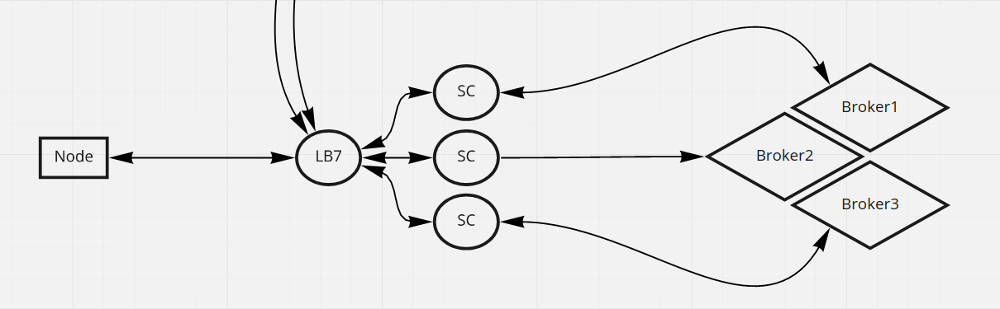

# Multibroker

Message brokers are communication services designed to connect  multiple clients on a centralized message channel, allowing each client to send and receive messages through this central service. This  form of communication is imperative on Inspr because it allows multiple applications to connect among themselfs, effectively forming a group in which every message send by one party is guaranteed to reach every other registered party.

Knowing what are message brokers and the central role they play on Inspr, we developed a easy way to configure new brokers on Insprd, giving the user the flexibility to choose the one that best fits their requirements.  


## How to configure your broker

To demonstrate how to configure your Inspr cluster with a new broker this will be a step-by-step guide to install **Kafka**, which for now is the only supported broker.

1. First thing you have to do is install the broker on you cluster. For Kafka this can be done simply by following this tutorial: https://bitnami.com/stack/kafka/helm.

2. Next you need to configure your Insprd Instance. This is done through a command that receives the specific broker you want to install and the required configuration of your broker's instance, which may differ from broker to broker.

   1. For Kafka the configurations you'll need to attain from your Kafka deployment are: 

      - Address of Kafka's bootstrap servers
      - The auto offset reset configuration

   2. With these informations you can proceed by creating the configuration file to send Insprd. This file will require two more pieces of information:

      - the image for that broker's sidecar, which Inspr provides to you 
      - the address you want that sidecar to be deployed at.

   The address by default should be `http://localhost` which just indicates that that deploy should happen on the same container as the other pieces of your dApp.
      If you followed the Helm installation for Kafka suggested above, the file you need should be exactly like this:

      `kafkaConfig.yaml`:

      ```yaml
      bootstrapServers: kafka.default.svc:9092
      autoOffsetReset: earliest
      sidecarImage: gcr.io/insprlabs/inspr/sidecar/kafka:latest
      sidecarAddr: "http://localhost"
      ```

      If you choose to install the broker some other way, the information may change but the **format should remain like the example above**.

      Finally if you are installing any broker other than Kafka you should consult the correct file format for that broker. 

   3. Once you have you configuration file all you need to do is run:

      ```shell
      insprctl cluster config kafka <relative_path_to>/your_file.yaml
      ```

      To which the expected response is: `successfully installed broker on insprd`. 

      This command works with the following pattern :

      ```sh
      insprctl cluster config <broker-name> <relative_file_path>
      ```

      Keep in mind:

      - `<broker-name>` must be one of the supported broker options for Inspr. This is actually not an argument, it is a sub-command.
      - `<relative_file_path>` must refer to a YAML file with the correct fields for the chosen broker.

   #### This is all, you've successfully configured you Insprd to work with Kafka.


## How does it work

By configuring your broker what you are doing is subscribing the corresponding sidecar for that broker into a *Factory*, allowing Insprd to deploy sidecars of this type whenever a *dApp* you create uses a *Channel* configured to work with this broker. The architecture to support the dynamic choice of sidecars is based on a **Load-balancer** that is responsible for connecting to all of the broker specific sidecars your *dApp* demands.





### Load Balancer

The load balancer is technically itself a sidecar, since it is deployed alongside every *Node* and is used by it as an intermediate to all communication, but it serves a different purposes. The load balancer is of central importance to the Multibroker architecture because of two of its functionalities: dynamic broker-specific sidecar balancing and serialization.

As discussed previously, when deploying a *Node* Insprd also deploys other artifacts, of these artifacts the Load Balancer is the only one that is attached to **all** deployed nodes. This is the case because it is **necessary** to allow the *Node* to communicate. During the deploy the *Node* is configured to communicate with the Load Balancer through requests to a `writeMessageHandler`, so every time it needs to send a message using a *Channel* it sends a request to the Load Balancer by providing it with the message and the targeted channel. Once the Load Balancer, which is configured with most of that *Node's Channels* informations,  receives a message request it verifies if that channel is valid, then sends a request to the sidecar that corresponds to the specified channel's broker.  This allows the *Node*'s client to send multiple messages without having to deal with the overhead related to broker verification, sidecar selection or message serialization, since each of these requests is handled by a separate thread, via the traditional *HTTP* server architecture.  

`writeMessageHandler`:

```go
func (s *Server) writeMessageHandler() rest.Handler {
	return func(w http.ResponseWriter, r *http.Request) {
		logger.Info("handling message write")
			
        // From the request's URL the LB obtains the targeted channel.
			channel := strings.TrimPrefix(r.URL.Path, "/")
        
		// Verification step to make sure the node can output on the targeted channel
            if !environment.OutputChannelList().Contains(channel) {
                logger.Error(fmt.Sprintf("channel %s not found in output channel list", channel))
                insprError := ierrors.New().
                    BadRequest().
                    Message("channel '%s' not found", channel)

                rest.ERROR(w, insprError.Build())
                return
            }
		
        // Once the channel is verified the broker searches for it's respective broker
            channelBroker, err := environment.GetChannelBroker(channel)
            if err != nil {
                logger.Error("unable to get channel broker",
                    zap.String("channel", channel),
                    zap.Any("error", err))

                rest.ERROR(w, err)
                return
            }

        // With all the channel's information parsed and verified, LB fetches the information 
        //required to reach the correct broker specific sidecar
            sidecarAddress := environment.GetBrokerSpecificSidecarAddr(channelBroker)
            sidecarWritePort := environment.GetBrokerWritePort(channelBroker)

			reqAddress := fmt.Sprintf("%s:%s/%s", sidecarAddress, sidecarWritePort, channel)

		logger.Debug("encoding message to Avro schema")
        
		// Message is encoded to avro
            encodedMsg, err := encodeToAvro(channel, r.Body)
            if err != nil {
                logger.Error("unable to encode message to Avro schema",
                    zap.String("channel", channel),
                    zap.Any("error", err))

                rest.ERROR(w, err)
                return
            }

		logger.Info("sending message to broker",
			zap.String("broker", channelBroker),
			zap.String("channel", channel))

        // Forwards the message to the broker specific sidecar
            resp, err := sendRequest(reqAddress, encodedMsg)
            if err != nil {
                logger.Error("unable to send request to "+channelBroker+" sidecar",
                    zap.Any("error", err))

                rest.ERROR(w, err)
                return
            }
		
        // Responds the Node
	    rest.JSON(w, resp.StatusCode, resp.Body)
	}
}
```

To receive information from these brokers the Load Balancer  serves a `readMessageHandler`, which is posted to by the broker specific sidecars when these receive a message from the broker itself. The read handler then parses from the request the *Channel* targeted by that operation, verifying if this *Channel* is in fact part of the *Node*'s *Boundaries*, if so, it then **deserializes** the message received, from *Avro* to *JSON*, and sends it to the *Node*'s client.

`readMessageHandler`:

```go
func (s *Server) readMessageHandler() rest.Handler {
	return func(w http.ResponseWriter, r *http.Request) {
		logger.Info("handling message read")

        // From the request's URL the LB obtains the targeted channel.
			channel := strings.TrimPrefix(r.URL.Path, "/")
        
		// Verification step to make sure the Node should receive input from the targeted channel
            if !environment.InputChannelList().Contains(channel) {
                logger.Error("channel " + channel + " not found in input channel list")
                insprError := ierrors.New().
                    BadRequest().
                    Message("channel '%s' not found", channel)

                rest.ERROR(w, insprError.Build())
                return
            }
        
		// With the channel parsed and verified, LB fetches the information 
        //required to forward the message to the Node
            clientReadPort := os.Getenv("INSPR_SCCLIENT_READ_PORT")
            if clientReadPort == "" {
                insprError := ierrors.New().
                    NotFound().
                    Message("[ENV VAR] INSPR_SCCLIENT_READ_PORT not found")

                rest.ERROR(w, insprError.Build())
                return
            }

		logger.Debug("decoding message from Avro schema")
        
        //Decode message from Avro to JSON
            decodedMsg, err := decodeFromAvro(channel, r.Body)
            if err != nil {
                logger.Error("unable to decode message from Avro schema",
                    zap.String("channel", channel),
                    zap.Any("error", err))

                rest.ERROR(w, err)
                return
            }

		logger.Info("sending message to node through: ",
			zap.String("channel", channel))

        // Forwards the message to the Node
            reqAddress := fmt.Sprintf("http://localhost:%v/%v", clientReadPort, channel)
            resp, err := sendRequest(reqAddress, decodedMsg)
            if err != nil {
                logger.Error("unable to send request from lbsidecar to node",
                    zap.Any("error", err))
                rest.ERROR(w, err)
                return
            }
		
        //Responds to the broker specific sidecar
	    rest.JSON(w, resp.StatusCode, resp.Body)
	}
}
```

