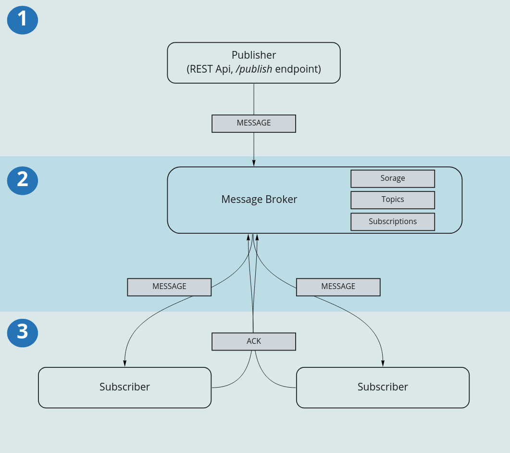

# Publish / Subscribe

Pub/Sub is an asynchronous messaging service that decouples services that produce events from services that process events. It is an architectural pattern where messages are sent in a 1:n manner

Very popular and useful, Pub/Sub offers reliable message storage and real-time delivery. Inspr is the perfect environment for these applications, seen that they benefit heavily from microservice structure as well as the shared communication Channels, both part of Inspr's main features. Being able to easily publish and change the dApp's structure also allows for great expandability, especially when it comes to adding new subscriber to the service.

Now we'll take a step by step look into how to build a Pub/Sub app on Inspr:

- Laying out the foundations.
- Publisher
- Subscriber
- Connection
- Publishing it

## Foundations

This section will cover the basic structure for the application. Divided in layers, what we are building will look something like this:



1. Publish:
   This layer is responsible for receiving messages from the user, these will be sent to the final clients. This is achieved by the endpoint `/publish`, served by a very simple REST API. Messages received via the endpoint are configured and sent, using the Channel we will be creating for the application, to the subscribers through the broker.

2. Broker:
   This layer is handled for us by inspr! Basically it receives messages on a Channel, stores them in a queue, and makes a copy of each message available for every reader of said Channel.

3. Subscribe:
   This layer is arguably the simplest one, it hosts an arbitrary number of subscriber dApps. Each of these dApps reads from the application's Channel, receiving the messages published by the user. Once it does get a message the subscriber configures it on it's client's desired format. Each client service expects a different set of information and flags, besides the main message text, it is the subscriber's job to correctly assemble a requisition and send it to it's client.

#### On Inspr:

Now that we have an understanding of the application we'll be developing, let's see how Inspr can help us build it!

The application as a hole is only complete if you consider all the previously explained Channels. However, as was said, we don't have to worry about the message broker, Inspr takes care of that. That leaves us with publishers and subscribers. The first thing we have to do is define a scope and Channel for our application, so let's configure a dApp.

Scope app (01.app.yaml) :

```yaml
kind: dapp
apiVersion: v1
meta:
  name: pubsub
```

Note that this dApp isn't a [Node](dapp_overview.md), that's because it serves as a workspace definition, it doesn't run any code.

Next we have to create a Channel the publisher can write text to and the subscribers can read from. Doing so is as simple as defining the following:

Type (02.ct.yaml) :

```yaml
kind: type
apiVersion: v1
meta:
  name: pubsubct
  parent: pubsub

schema: { "type": "string" }
```

Channel (03.ch.yaml) :

```yaml
kind: channel
apiVersion: v1
meta:
  name: pubsubch
  parent: pubsub
  annotations:
    kafka.replication.factor: 1
    kafka.partition.number: 1
spec:
  type: pubsubct //Type defined above
```

Now all there is left to is creating the subscribers' dApps. Since we could build any number of subscribers, depending on what clients we would like interact with, consider the following example a template for their files.

Subscribers (05-6.app.yaml) :

kind: dapp
apiVersion: v1

meta:
name: <subscribername>
parent: pubsub # parent app name
spec:
node:
spec:
replicas: 1
environment:
image: <access point to this app's image>
boundary:
input: - pubsubch #Channel created above
output: #empty

These are all the basic building blocks we'll need !

## Publisher

Implementation of the publisher goes as you would expect any simple REST API to go. First we build the API's server that will support our endpoint. Following that the data model that will be received in a requisition must be defined. In this example the API expects a JSON with only one field, `message` which is a string. The handler is the last part, all it should do is receive the message from the user and send it to the subscribers using the Channel we created earlier.

API (api/main.go) : Entry point for the server, must be a `package main` so that it executes on the container.

```go
   package main

   import (
       controller "github.com/inspr/inspr/examples/pubsub/api/controller"
   )

   var server controller.Server

   // main is the server start up function
   func main() {
       server.Init()
       server.Run(":8080")
   }
```

Run method (api/controller/base.go):

```go
   // Run starts the server on the port given in addr
   func (s *Server) Run(addr string) { // this is called by the main()
       fmt.Printf("pubsub api is up! Listening on port: %s\n", addr)
       log.Fatal(http.ListenAndServe(addr, s.Mux))
   }
```

Init method (api/controller/base.go) : This is responsible for allocating the server muxer and inserting our handler on it.

```go
   // Init - configures the server
   func (s *Server) Init() {
       s.Mux = http.NewServeMux()
       client := dappclient.NewAppClient()
       s.Mux.HandleFunc("/publish", func(w http.ResponseWriter, r *http.Request) {
           ctx, cancel := context.WithCancel(context.Background())
           defer cancel()
           data := Message{}
           decoder := json.NewDecoder(r.Body)

           err := decoder.Decode(&data)
           if err != nil {
               rest.ERROR(w, err)
               return
           }

           discordMsg := models.Message{
               Data: data.Message,
           }
           if err := client.WriteMessage(ctx, discordCH, discordMsg); err != nil {
               fmt.Println(err)
               rest.ERROR(w, err)
           }

           rest.JSON(w, http.StatusOK, nil)
       })
   }
```

## Subscribers

As most applications that run on Inspr the subscribers only execute their tasks when they receive a message through it's dApp client. Because of this, their structure is characteristic, an endless loop with a read from some desired Channel. These programs must also have access to the structure the client is expecting and be able to convert the simple text message it will receive to this format. Once the message has been sent to the clients the message is committed, acknowledging to the message broker that that application is done with that message and can go on to the next one.

These examples were implemented using webhooks that receive JSON objects with specific fields.

### Discord Sub (discord.main) :

```go
   type DiscordMessage struct {
       Content   string `json:"content"`
       Username  string `json:"username"`
       AvatarURL string `json:"avatar_url"`
       TTS       bool   `json:"tts"`
       File      []byte `json:"file"`
       Embedded   []byte `json:"embeds"`
   }

   var webhook = <your webhook link>
   var channel = "pubsubch" // <Channel created on parent app>

   func main() {
       c := &http.Client{}
       client := dappclient.NewAppClient()
       for {

           subMsg, err := client.ReadMessage(context.Background(), Channel)
           if err != nil {
               log.Println(err)
               continue
           }
           //Body object instansiation
           msg := DiscordMessage{
               Content:   fmt.Sprintf("%v", subMsg.Data),
               Username:  "Notifications",
               AvatarURL: "",
               TTS:       true,
           }
           //Encoding object as a json
           msgBuff, _ := json.Marshal(msg)

           req, _ := http.NewRequest(http.MethodPost, webhook, bytes.NewBuffer(msgBuff))
           head := http.Header{}
           head.Add("Content-type", "application/json")
           req.Header = head
           _, err = c.Do(req)
           if err != nil {
               log.Println(err)
               continue
           }
           //commit, if no error occurred
           if err := client.CommitMessage(context.Background(), Channel); err != nil {
               log.Println(err.Error())
           }
       }
   }
```

## Connection

Hosting a server with an entry point on your cluster doesn't make it so that you can access it remotely, to do so you must create a kubernetes ingress point and a service. Luckily these are easy to make and there is an example right here! To connect your application to these entrypoints you could remember that on the cluster an app's name is the full path to the app, separated by hyphens.

SVC:

```yaml
   apiVersion: v1
   kind: Service
   metadata:
   name: pubsub-publish-front
   namespace: inspr-apps
   spec:
   selector:
       app: pubsub-pubsubapi //app cluster name
   ports:
       - protocol: TCP
       port: 80
       targetPort: 8080
```

Ingress:

```yaml
   apiVersion: networking.k8s.io/v1beta1
   kind: Ingress
   metadata:
   name: pubsub-ingress
   namespace: inspr-apps
   annotations:
       kubernetes.io/ingress.class: "nginx"
       cert-manager.io/issuer: "letsencrypt-prod"
   spec:
   rules:
       - host: inspr.com

       http:
           paths:
           - path: /publish
               backend:
               serviceName: pubsub-publish-front
               servicePort: 80
```

## Publishing it

Your app is now done, but before publishing it first you must build it. Inspr requires code to be built into an accessible Docker image in order for it to be deployed on the cluster. There is an example for building on the [pingpong example](../examples/pingpong_demo/README.md). You should create simple Dockerfiles to build your dApps and push them to any storage were they are accessible your cluster. That being done is finally time to publish your Pub/Sub application. Publishing it to your insprctl cluster is easy, but first make sure your files look something like this:

```tree
   pubsub
   ├── api
   │   ├── controller
   │   │   └── base.go
   │   ├── Dockerfile
   │   └── main.go
   ├── discord
   │   ├── Dockerfile
   │   └── main.go
   ├── img
   │   └── pubsub.jpg
   ├── inspr
   │   ├── 01.app.yaml
   │   ├── 02.ct.yaml
   │   ├── 03.ch.yaml
   │   ├── 04.app.yaml
   │   ├── 05.app.yaml
   │   ├── 06.app.yaml
   │   └── schema.avsc
   ├── k8s
   │   ├── ingress.yaml
   │   └── svc.yaml
   ├── Makefile
   ├── Readme.md
   └── slack
       ├── Dockerfile
       └── main.go
```

Keep in mind Slack an Discord are only examples.

Deployment:
You have to apply every yaml we created, dApps Channels and Types can be done by running:
insprctl apply -k yamls

Your ingress and service have to be deployed as well, run:
kubectl apply -f k8s/ingress.yaml
kubectl apply -f k8s/svc.yaml
