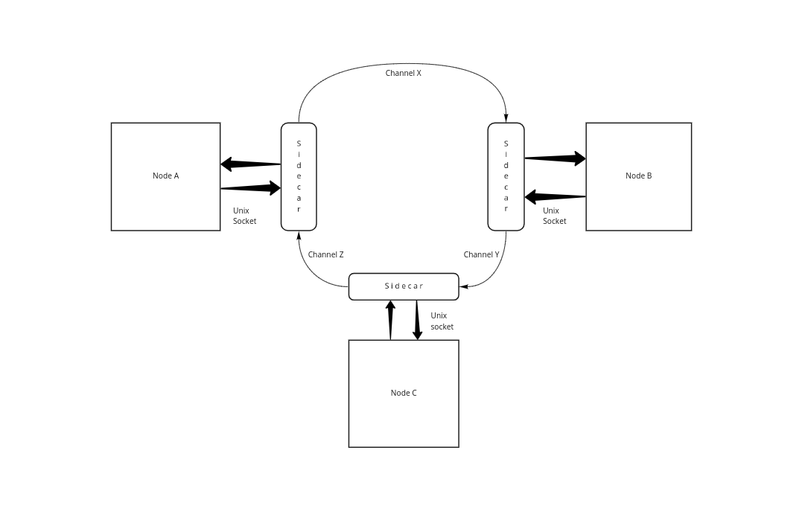
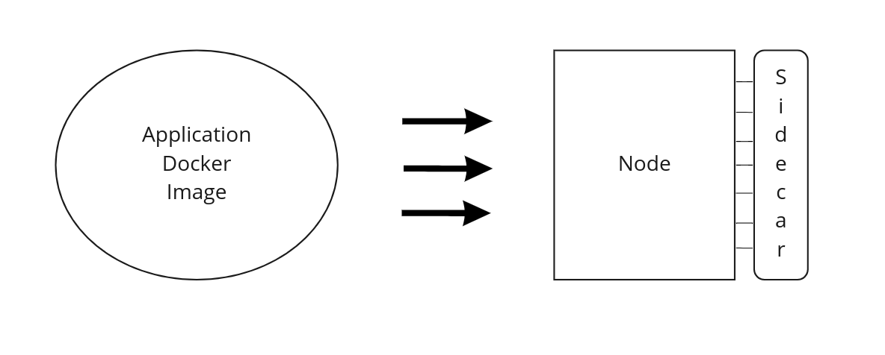

# Sidecar API

## Sidecar Architecture

The content below is a documentation about the Inspr Sidecar component. The main purpose of the text is to abord how it is created, how it acts in the context of the cluster and what are its genereal responsibilities.

### Overview

When creating an Inspr's dApp in your cluster it's possible to define the Input and Output of your application. That means that, in the perspective of the `dApp`, there is a way in which it can easily communicate with other dApps - through Inspr `Channels`. This component is somewhat intuitive, but he alone is not responsible for the exchange of data between dApps. The structure that allows for easy communication is the so-called `sidecar`.

But what is exactly a `sidecar` and how can it be utilized? 

First is important to remember that Inspr uses message brokers for communication. This means that there are topics in which applications can write to and read from. And this is exactly where the `sidecar` acts, by being a layer of abstraction that simplifies the whole process by a substantial margin.

The Sidecar is already implemented and resolves most of the proceedings that one must do to send data to a topic in the message broker, or to read from it. This means that, by using the Sidecar API, a developer can focus on his application, and when trying to communicate with another dApp in his cluster there is only the need to do a HTTP request with the content of the message.



### How is the Sidecar created?

When creating a dApp that contains a Node the user must specify its content, that means creating the docker image of his application and in the yaml of the Node adding the location of the image. It is also necessary to specify the Channels which this dApp/Node can communicate through.

When the Inspr daemon receives both of this information, the Node is created according to the Docker image specified in it. It also creates a Sidecar attached to it, like the example below:




### Unix Socket

The Sidecar maintains the communication between its Node and the message broker, but what is represented in the image above as lines connecting the Sidecar and Node is in actuality an Unix Socket.

An Unix Socket is a shared partition between the Node and the Sidecar's Server. It is an extremely reliable and fast method that allows for a quicker exchange of information.

### The client side

On the client side there are three main methods that are used to process information:

 - ReadMessage
 - WriteMessage
 - CommitMessage

These three methods are responsible to establish a solid communication between the dApp and the Sidecar, and all of this is done through the Unix Socket.


#### ReadMessage
```go
// ReadMessage receives a channel and sends it in a request to the sidecar server
func (c *Client) ReadMessage( ctx context.Context, channel string, message interface{} ) error
```

 Description of parameters
- Context: [golang's context](https://golang.org/pkg/context/), a way to carry deadlines and cancel signals.
- Channel: Name of the Channel in which the message will be read from.
- Message: A user defined struct that allows him to establish his own format to the message going to the Channel, as it can be seen in the snippets below:
    - Message definition examples
      - `Message{ Content: struct{your definition} 'json:"data"' } 'json:"message"'`
      - `Message{ Content: int 'json:"data"' } 'json:"message"'`
      - `Message{ Content: string 'json:"data"' } 'json:"message"'`
    - Important to noticed that both json tags are mandatory

##### Snippet example:
```go
type Message struct {
    Message struct {
        Data int `json:"data"`
    } `json:"message"`    
}

var msg Message

err := client.ReadMessage(
    context.Background(),
    inputChannel,
    &msg,
)
```

#### CommitMessage

```go
// CommitMessage receives a channel and sends it in a request to the sidecar server
func (c *Client) CommitMessage(ctx context.Context, channel string) error 
```

 Description of parameters
- Context: [golang's context](https://golang.org/pkg/context/), a way to carry deadlines and cancel signals.
- Channel: Name of the Channel in which the message was read from.

##### Snippet example:
```go
...
err := client.ReadMessage(
    context.Background(),
    inputChannel,
    &msg,
)
...
// do stuff with the data
...
err = client.CommitMessage(
    context.Background(),
    inputChannel,
)
```


#### WriteMessage

```go
// WriteMessage receives a channel and a message and sends it in a request to the sidecar server
func (c *Client) WriteMessage(ctx context.Context, channel string, msg models.Message) error
```

 Description of parameters
- Context: [golang's context](https://golang.org/pkg/context/), a way to carry deadlines and cancel signals.
- Channel: Name of the Channel in which the message will be sent to.
- Message: A struct that contains only the field `Data`
    - Data: An interface{} type that allows the user to send anything to the channel.

##### Snippet example
```go
client.WriteMessage(
    context.Background(),
    outputChannel,
    models.Message{
        Data: 123,
    },
)
```

### The server side

The Sidecar server is responsible for reading from and writing to the message broker. It implements a simple rest API to interact with the client, which has 3 endpoints.

These endpoints are: 
- "/readMessage"
- "/writeMessage"
- "/commit".
 
Respectively these implement the server-side functionalities to: 
- ReadMessage: reads a message from a specific Channel
- WriteMessage: writes a message to a specific Channel
- Commit: confirms that a message has been read

Each server has two environment variables that determine which Channels it can use for input and output. When it receives a request it first checks whether or not the Channel specified on the request is valid for the requested operation. Following that, it simply completes the operation.

One small observation is that when trying to send a message, if an unknown Channel is specified in the Client, the server will identify that such Channel doesn't exist and return an error to the Client request.
