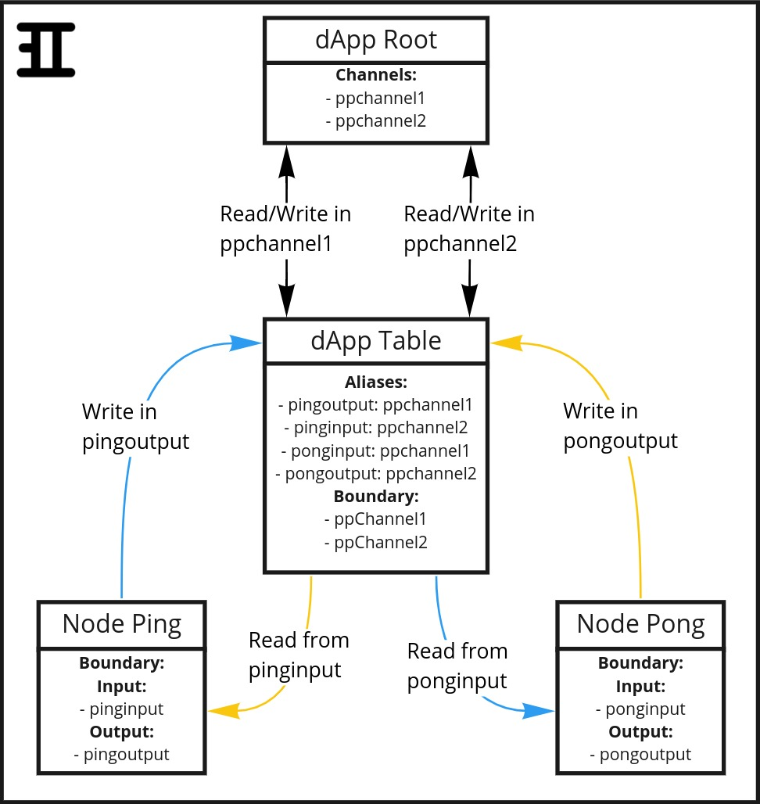
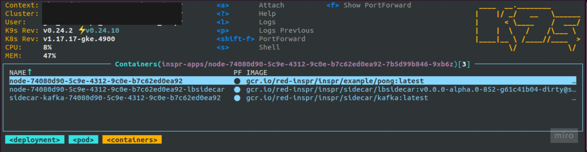
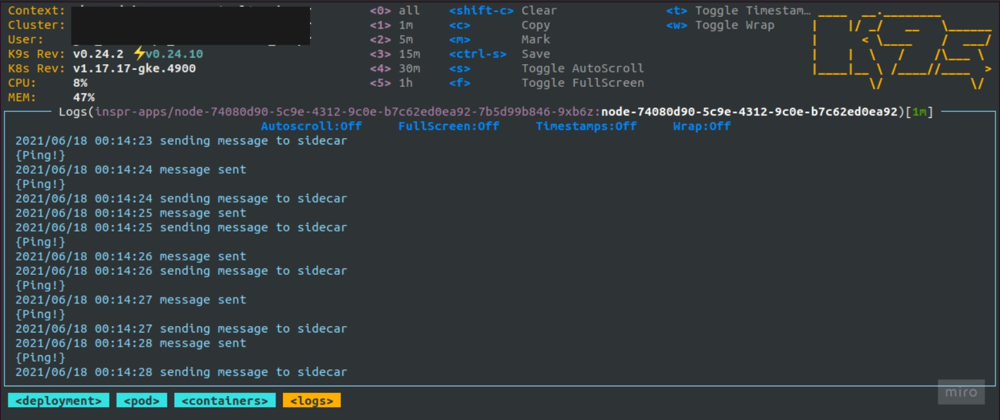

# Workspace Initialization

This document is a detailed guide on how to create an application and deploy an Inspr workspace that cointains it into a Kubernetes cluster.

**It is mandatory to have [Docker](https://docs.docker.com/get-docker/), [Kubernetes](https://kubernetes.io/docs/tasks/tools/), [Insprd](helm_installation.md) and [Inspr CLI](cli-install.md) installed.**  
Also, this tutorial will be using the Message Broker [Apache Kafka](https://kafka.apache.org/). You can see how to install it in your cluster [here](https://bitnami.com/stack/kafka/helm).

The Inspr workspace that will be created through this guide contains two applications that communicate with each other:

- **Ping**, that writes the string "Ping!" into a Channel, and reads what's written by the other application in another Channel.
- **Pong**, that writes the string "Pong!" into a Channel, and reads what's written by the other application in another Channel.

The tree-like structure of this Inspr workspace will be similar to this:



## Creating the folder structure

First of all, let's create the folders in which we will store all of our files (application codes, Dockerfiles, YAMLs, etc.).

Create a folder called "pingpong_demo", and inside of it create other three folders: "ping", "pong" and "yamls".

The first two, "ping" and "pong", will store the applications code and their respective Dockerfiles. The last one, "yamls", will store all the _.yaml_ files that define the structures which will be used to create the Inspr workspace in the cluster.

The following command creates the wanted folder structure:

```zsh
mkdir -p pingpong_demo/ping pingpong_demo/pong pingpong_demo/yamls
```

It should be organized like this:

```
pingpong_demo
├── ping
├── pong
└── yamls
```

## Creating the applications

In this part, we will implement Ping and Pong using Golang. Also, we will create their respective Dockerfiles, build the Docker Images and push them into the cluster.  
To start off, inside of "/pingpong_demo", run the following command:

```go
go mod init pingpong
```

If you're not familiar with `go mod`, you can learn more about it [here](https://golang.org/ref/mod#go-mod-init)

### Ping and Pong implementation

From within "pingpong_demo", create a file called _ping.go_ inside the folder "ping":

```zsh
touch ping/ping.go
```

In _ping.go_, we will define a `main` function that does the following:

1. Creates a new dApp Client, which is used to write and read messages in Channels through the Sidecar (check [dApp Architecture Overview](dapp_overview.md) for more details).
2. Initiates an endless `for loop` in which the message "Ping!" is written in the Channel _pingoutput_, then the application proceeds to read a message from Channel _pinginput_. If there are any messages, they are read and displayed in the terminal.

To begin the implementation we first must declare a new structure type, here called `expectedDataType`, which contains a field called "Channel" that is a string, and another field called "Message" that is a struct:

```go
type expectedDataType struct {
	Message struct {
		Data string `json:"data"`
	} `json:"message"`
	Channel string `json:"channel"`
}
```

**In Inspr, the user must define which type of message he expects to read from a Channel, so that unexpected messages of different types don't cause unexpected errors.**  
So everytime one implements an application that reads messages, a structure such as the following should be created and passed as an argument for the `ReadMessage` method:

```go
type YOUR_STRUCTURE_NAME struct {
	Message struct {
		Data DESIRED_DATA_TYPE `json:"data"`
	} `json:"message"`
	OPTIONAL_FIELD_1 string `json:"OPTIONAL_FIELD_1_TAG"`
	OPTIONAL_FIELD_2 int `json:"OPTIONAL_FIELD_2_TAG"`
	OPTIONAL_FIELD_3 struct `json:"OPTIONAL_FIELD_3_TAG"`
	...
}
```

As seen above, the only mandatory fields inside of your custom structure are `Message` and `Data`, and their respective [JSON tags](https://medium.com/golangspec/tags-in-golang-3e5db0b8ef3e). `Data`'s field type is chosen by you, and can even be a new structure!

We then can proceed to create the `main` function itself. Before starting the `for loop` (referenced previously) a new dApp client must be instantiated to enable the Node-Sidecar communication:

```go
func main() {

	client := dappclient.NewAppClient()
	ctx, cancel := context.WithCancel(context.Background())
	defer cancel()
}
```

Now the `for loop` must be created. Inside of it, the following steps must be implemented:

1. Define which message will be written by this application, which will be the string "Ping!":

```go
	sentMsg := models.Message{
		Data: "Ping!",
	}
```

2. Send the message defined in step 1 to the Ping dApp's output Channel:

```go
	if err := client.WriteMessage(ctx, "pingoutput", sentMsg); err != nil {
		fmt.Println(err)
		continue
	}
```

3. Use the structure `expectedDataType` created by us to read messages from Ping dApp's input Channel, and then print these messages:

```go
	var recMsg expectedDataType
	err := client.ReadMessage(ctx, "pinginput", &recMsg)
	if err != nil {
		fmt.Println(err)
		continue
	}
	fmt.Println("Read message: ")
	fmt.Println(recMsg.Message.Data)
```

4. Send a commit to the Message Broker, which signs it that our application has finished processing the message (click [here](https://quarkus.io/blog/kafka-commit-strategies/) for more information about Commit in Kafka):

```go
	if err := client.CommitMessage(ctx, "pinginput"); err != nil {
		fmt.Println(err.Error())
	}
```

When completed, your Ping implementation should look like this:

```go
package main

import (
	"fmt"

	dappclient "github.com/inspr/inspr/pkg/client"
	"github.com/inspr/inspr/pkg/sidecar/models"
	"golang.org/x/net/context"
)

type expectedDataType struct {
	Message struct {
		Data string `json:"data"`
	} `json:"message"`
	Channel string `json:"channel"`
}

func main() {

	client := dappclient.NewAppClient()
	ctx, cancel := context.WithCancel(context.Background())
	defer cancel()

	for {
		sentMsg := models.Message{
			Data: "Ping!",
		}

		if err := client.WriteMessage(ctx, "pingoutput", sentMsg); err != nil {
			fmt.Println(err)
			continue
		}

		var recMsg expectedDataType
		err := client.ReadMessage(ctx, "pinginput", &recMsg)
		if err != nil {
			fmt.Println(err)
			continue
		}
		fmt.Println("Read message: ")
		fmt.Println(recMsg.Message.Data)

		if err := client.CommitMessage(ctx, "pinginput"); err != nil {
			fmt.Println(err.Error())
		}
	}
}
```

A similar folder/file structure and code must be done to implement Pong. So, from within "pingpong_demo", create _pong.go_ in /pong folder:

```zsh
touch pong/pong.go
```

And then write a code similar to _ping.go_'s, just remember to switch the Channels and the message that is written. It should look like this:

```go
package main

import (
	"fmt"

	dappclient "github.com/inspr/inspr/pkg/client"
	"github.com/inspr/inspr/pkg/sidecar/models"
	"golang.org/x/net/context"
)

type expectedDataType struct {
	Message struct {
		Data string `json:"data"`
	} `json:"message"`
	Channel string `json:"channel"`
}

func main() {

	client := dappclient.NewAppClient()
	ctx, cancel := context.WithCancel(context.Background())
	defer cancel()

	for {
		sentMsg := models.Message{
			Data: "Pong!",
		}

		if err := client.WriteMessage(ctx, "pongoutput", sentMsg); err != nil {
			fmt.Println(err)
			continue
		}

		var recMsg expectedDataType
		err := client.ReadMessage(ctx, "ponginput", &recMsg)
		if err != nil {
			fmt.Println(err)
			continue
		}
		fmt.Println("Read message: ")
		fmt.Println(recMsg.Message.Data)

		if err := client.CommitMessage(ctx, "ponginput"); err != nil {
			fmt.Println(err.Error())
		}
	}
}
```

To finish implementing the applications, we must assure that all dependencies are resolved. To do so, inside of "/pingpong_demo", run the following command:

```go
go mod tidy
```

### Dockerfiles

Now that we have Ping and Pong implemented and doing what they are supossed to do, we must create their Dockerfiles so a Docker Image for each of them can be generated, and make these images available in our cluster.  
If you are not familiar with Docker, click on the following links for more information:

- [Docker overview](https://docs.docker.com/get-started/overview/)
- [Docker Images](https://jfrog.com/knowledge-base/a-beginners-guide-to-understanding-and-building-docker-images/#:~:text=A%20Docker%20image%20is%20a,publicly%20with%20other%20Docker%20users.)
- [Dockerfiles](https://docs.docker.com/engine/reference/builder/)

From within "pingpong_demo", create a file called _Dockerfile_ inside folder "ping":

```zsh
touch ping/Dockerfile
```

The Dockerfile structure will be created to do the following:

1. Use Golang alpine version as base to run the commands.
2. Define "/app" as the working directory where Ping will be build.
3. Copy the _ping.go_ file into "/app".
4. Build _ping.go_ to generate a binary for this file.
5. Execute the binary generated.

Ping's Dockerfile should look like this:

```docker
FROM golang:alpine AS build
WORKDIR /app
COPY . .
RUN go build -o main ping/ping.go

FROM alpine
WORKDIR /app
COPY --from=build /app/main .
CMD ./main
```

Then, do the same steps for Pong:

```zsh
touch pong/Dockerfile
```

And Pong's Dockerfile content:

```docker
FROM golang:alpine AS build
WORKDIR /app
COPY . .
RUN go build -o main pong/pong.go

FROM alpine
WORKDIR /app
COPY --from=build /app/main .
CMD ./main
```

### Docker Image deployment

After creating the Dockerfiles, we must build the Docker images and push each of them into the cluster, so they are available to be used in the Inspr workspace.

First, from "/pingpong_demo", go into "/ping" folder:

```zsh
cd ping
```

In the next steps, it's important to have a [container registry](https://cloud.google.com/container-registry) up and running, so it's possible to store and use the images that will be built.

Then, from the "pingpong_demo" folder, we must build the Docker image by using the Dockerfile previously created. You can apply a tag to it by adding `:TAG_NAME`, if desired:

```zsh
docker build -f ping/Dockerfile -t CONTAINER_REGISTRY_REF/app/ping:TAG_NAME .
```

Finally, we push the builded image into the cluster, where **CONTAINER_REGISTRY_REF is a reference to the container registry**:

```zsh
docker push CONTAINER_REGISTRY_REF/app/ping:latest
```

Now the same must be done to Pong. Go back to "/pingpong_demo" folder, and access "/pong" folder:

```zsh
cd ..
cd pong
```

From "/pingpong_demo" folder, build the Docker image by using the Dockerfile previously created (and applying a tag to it, if desired):

```zsh
docker build -f pong/Dockerfile -t CONTAINER_REGISTRY_REF/app/pong:TAG_NAME .
```

Push the builded image into the cluster:

```zsh
docker push CONTAINER_REGISTRY_REF/app/pong:TAG_NAME
```

**Alternatively, you can create a [Makefile](https://opensource.com/article/18/8/what-how-makefile) that will do the previous steps for you.**  
Inside "/pingpong_demo" folder, create a new file called "Makefile:

```zsh
touch Makefile
```

The Makefile should contain the same Docker commands that you'd use to build and push Ping and Pong Docker images. The gain here is that instead of writing and executing four different commands, you just execute the Makefile. It should look like this:

```makefile
build:
	docker build -t CONTAINER_REGISTRY_REF/app/pong:TAG_NAME -f ping/Dockerfile .
	docker push CONTAINER_REGISTRY_REF/app/pong:TAG_NAME
	docker build -t CONTAINER_REGISTRY_REF/app/pong:TAG_NAME -f pong/Dockerfile .
	docker push CONTAINER_REGISTRY_REF/app/pong:TAG_NAME
```

And then execute the Makefile through the terminal:

```zsh
make
```

## Creating Inspr Workspace

Now that we have our applications implemented and their Docker images available in the cluster, we're good to go and build Inspr structures to use what we created.

### YAML Files

First of all, from "/pingpong_demo" we access the folder "/yamls" created previously.

```zsh
cd yamls
```

And within this folder we will create the _.yaml_ files which describe each of the Inspr structures that will be built inside the cluster. This part of the tutorial wont take a closer look at every minimum detail on how to write the YAML files, but you can find more information about it [here](yamls/index.md).

**1) dApp YAMLs**  
The first file to be created is _table.yaml_, which is the dApp that will contain Ping and Pong Nodes:

```zsh
touch table.yaml
```

As it's described in Inspr YAMLs documentation, we must specify the kind, apiVersion and then the dApp information. This specific dApp will work as a link between Ping/Pong and the Channels which they'll communicate through. Basically, it will connect Ping and Pong's Boundaries to Channels defined in the root dApp through Aliases. You can read more about Aliases and this dApp structure [here](dapp_overview.md).  
The YAML should be the following:

```yaml
kind: dapp
apiVersion: v1

meta:
  name: pptable
spec:
  aliases:
    ping.pingoutput:
      target: ppchannel1
    ping.pinginput:
      target: ppchannel2
    pong.ponginput:
      target: ppchannel1
    pong.pongoutput:
      target: ppchannel2
  boundary:
    input:
      - ppchannel1
    output:
      - ppchannel2
```

The next file to be created is _ping.app.yaml_, in which we describe the Node that contains Ping. For better organization, let's create a new folder inside of "/yamls" called "nodes", inside of which we will store the Nodes YAMLs:

```zsh
mkdir nodes
touch nodes/ping.app.yaml
```

Then, insite of _ping.app.yaml_ we must specify the kind, apiVersion and then the Node information (such as name, boundaries, image, etc.).  
It should look like this:

```yaml
kind: dapp
apiVersion: v1

meta:
  name: ping
  parent: pptable
spec:
  node:
    spec:
      replicas: 1
      environment:
        SUPER_SECRET_0001: "false"
      image: CONTAINER_REGISTRY_REF/app/ping:TAG_NAME
  boundary:
    input:
      - pinginput
    output:
      - pingoutput
```

The `image` field must be a reference to the same image built in the step "Docker Image deployment". Also, the `environment` field is defined just so we can see that the environment variable "SUPER_SECRET_0001" will be created in the cluster, inside Ping's deployment.

Now, we do the same for Pong:

```zsh
touch nodes/pong.app.yaml
```

And _pong.app.yaml_ should look like this:

```yaml
kind: dapp
apiVersion: v1

meta:
  name: pong
  parent: pptable
spec:
  node:
    spec:
      image: CONTAINER_REGISTRY_REF/app/pong:TAG_NAME
  boundary:
    input:
      - ponginput
    output:
      - pongoutput
```

Notice that we didn't specify the number of replicas for Pong. This is to show that, **if not specified, the default number of replicas is created, which is one replica.**

**2) Channel YAMLs**  
As it can be seen in dApp Table YAML, the four different Boundaries defined in Ping and Pong (`pinginput`, `pingoutput`, `ponginput` and `pongoutput`) actually refer only to two Channels, `ppchannel1` and `ppchannel2`, which need to be created in the root dApp.  
Similar to a dApp, we must specify the kind, apiVersion and then the Channel information. Notice that the Channels annotations refer to Kafka attributes, as we're using Kafka as our Message Broker.

Let's proceed to create "/channels" folder inside of "/yamls", and then create _ch1.yaml_:

```zsh
mkdir channels
touch channels/ch1.yaml
```

It's content should be:

```yaml
kind: channel
apiVersion: v1
meta:
  name: ppchannel1
  annotations:
    kafka.replication.factor: 1
    kafka.partition.number: 2
spec:
  type: pptype1
```

Now we do the same for _ch2.yaml_:

```zsh
touch channels/ch2.yaml
```

And it's content should be:

```yaml
kind: channel
apiVersion: v1

meta:
  name: ppchannel2
  annotations:
    kafka.replication.factor: 1
    kafka.partition.number: 2
spec:
  type: pptype1
```

**3) Type YAML**
Both Channels use the same Type to define the kind of message that goes through them. So we must specify the kind, apiVersion and then the Type information for it to be created in the same context (the same dApp) as the Channels'.  
First we create "/types" folder and _ct1.yaml_:

```zsh
mkdir types
touch types/ct1.yaml
```

And it's content should be:

```yaml
kind: type
apiVersion: v1

meta:
  name: pptype1
schema: yamls/types/schema.avsc
```

Notice that the `schema` field is actually a reference to an **Avro Schema** file. By defining it like this, when a Type is created Inspr searches for the file and injects its value into the `schema` fiel. You can find more information on how schemas should be created to be used in Inspr [here](schemas_and_types.md).  
To make everythink work properly, let's create _schema.avsc_:

```zsh
touch types/schema.avsc
```

As we defined in our Ping and Pong applications, the type of information that they will send and receive is just a simple string. To do so, _schema.avsc_ content should be:

```
{"type":"string"}
```

After creating all of these folders and files, you should have this:

```
pingpong_demo
├── Makefile
├── ping
│   ├── Dockerfile
│   └── ping.go
├── pong
│   ├── Dockerfile
│   └── pong.go
└── yamls
    ├── channels
    │   ├── ch1.yaml
    │   └── ch2.yaml
    ├── types
    │   ├── ct1.yaml
    │   └── schema.avsc
    ├── nodes
    │   ├── ping.app.yaml
    │   └── pong.app.yaml
    └── table.yaml
```

### Deploying dApps, Channels and Type

Finally, now that we have Ping and Pong images in the cluster and all Inspr workspace structures well-defined in YAML files, we can deploy everything that we created and see it working in our cluster.

First of all, we need to check if **Inspr CLI** is referring to the [cluster ingress](https://kubernetes.io/docs/concepts/services-networking/ingress/) address, so we're able to send requests to it. To do so, run the command:

```zsh
inspr config list
```

And something similar to the following should be shown:

```zsh
Available configurations:
- scope: ""
- serverip: "http://localhost:8080"
```

If the `serverip` is not your cluster ingress host, such as the example above, you must change it:

```zsh
inspr config serverip "CLUSTER_INGRESS_HOST"
```

And this will be printed in the terminal:

```zsh
Success: inspr config [serverip] changed to 'CLUSTER_INGRESS_HOST'
```

Now, from within "/pingpong_demo" folder, we apply the YAML files by using Inspr CLIs commands. The files should be applied in the following order:

1. Type `pptype1`
2. Channels `ppchannel1` and `ppchannel2`
3. dApp `pptable`
4. Nodes `ping` and `pong`

You can do so by running the following commands from within "/pingpong_demo" folder:

```
inspr apply -k yamls/types
inspr apply -k yamls/channels
inspr apply -f yamls/table.yaml
inspr apply -k yamls/nodes
```

To learn more about Inspr CLI, check [this](cli/inspr.md) documentation.

If everything worked fine, the Inspr deamon will have printed a changelog similar to the following for each command written in your terminal:

```zsh
➜  pingpong_demo ✗ inspr apply -k yamls/types
ct1.yaml
On:
Field                         | From       | To
Spec.Types[pptype1]   | <nil>      | {...}

Applied:
ct1.yaml | Type | v1

➜  pingpong_demo ✗ inspr apply -k yamls/channels
ch1.yaml
On:
Field                       | From       | To
Spec.Channels[ppchannel1]   | <nil>      | {...}
ch2.yaml
On:
Field                       | From       | To
Spec.Channels[ppchannel2]   | <nil>      | {...}

Applied:
ch1.yaml | channel | v1
ch2.yaml | channel | v1

➜  pingpong_demo ✗ inspr apply -f yamls/table.yaml
yamls/table.yaml
On: pptable
Field                           | From       | To
Meta.Name                       |            | pptable
Spec.Boundary.Input             | <nil>      | ppchannel1
Spec.Boundary.Output            | <nil>      | ppchannel2
Spec.Aliases[pong.ponginput]    | <nil>      | ppchannel1
Spec.Aliases[pong.pongoutput]   | <nil>      | ppchannel2
Spec.Aliases[ping.pinginput]    | <nil>      | ppchannel2
Spec.Aliases[ping.pingoutput]   | <nil>      | ppchannel1
On:
Field                | From       | To
Spec.Apps[pptable]   | <nil>      | {...}

Applied:
yamls/table.yaml | dapp | v1

➜  pingpong_demo ✗ inspr apply -k yamls/nodes
ping.app.yaml
On: pptable.ping
Field                                           | From       | To
Meta.Name                                       |            | ping
Meta.Parent                                     |            | pptable
Spec.Node.Meta.Name                             |            | ping
Spec.Node.Meta.Parent                           |            | pptable
Spec.Node.Spec.Image                            |            | gcr.io/red-inspr/inspr/example/ping:latest
Spec.Node.Spec.Replicas                         | 0          | 1
Spec.Node.Spec.Environment[SUPER_SECRET_0001]   | <nil>      | false
Spec.Boundary.Input                             | <nil>      | pinginput
Spec.Boundary.Output                            | <nil>      | pingoutput
On: pptable
Field             | From       | To
Spec.Apps[ping]   | <nil>      | {...}
pong.app.yaml
On: pptable.pong
Field                   | From       | To
Meta.Name               |            | pong
Meta.Parent             |            | pptable
Spec.Node.Meta.Name     |            | pong
Spec.Node.Meta.Parent   |            | pptable
Spec.Node.Spec.Image    |            | gcr.io/red-inspr/inspr/example/pong:latest
Spec.Boundary.Input     | <nil>      | ponginput
Spec.Boundary.Output    | <nil>      | pongoutput
On: pptable
Field             | From       | To
Spec.Apps[pong]   | <nil>      | {...}

Applied:
ping.app.yaml | dapp | v1
pong.app.yaml | dapp | v1
```

## And, finally, it's done! You have just initialized your Inspr workspace!

To check if everything worked and that Ping and Pong deployments were created, run the following command in your terminal:

```zsh
kubectl get deploy --namespace inspr-apps
```

And a message like this should be displayed:

```
NAME           READY   UP-TO-DATE   AVAILABLE   AGE
pptable-ping   1/1     1            1           12m
pptable-pong   1/1     1            1           12m
```

To check if Ping and Pong are actually writing and reading messages, you can access you cluster informations by using [k9s](https://github.com/derailed/k9s).  
In k9s, access the deployments `pptable-ping` or `pptable-pong`, then access the pod within it. The pod should contain two containers, one for the Node and the other for it's Sidecar:



And by accessing the Node's container, you'll be able to see the application running!


